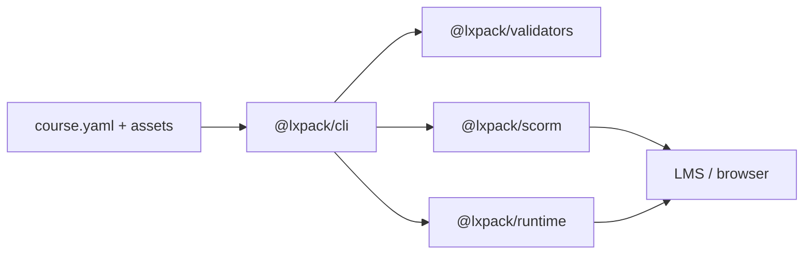

# LXPack

[](https://github.com/eddiethedean/lxpack/actions/workflows/ci.yml)
[](https://github.com/eddiethedean/lxpack/actions/workflows/release.yml)
[](https://www.npmjs.com/package/@lxpack/cli)
[](https://github.com/eddiethedean/lxpack/blob/main/LICENSE)
[](https://nodejs.org/)

**AI-native learning experience compiler and runtime** — build web-native courses from declarative manifests, preview them locally, validate structure with schemas, and export SCORM 1.2 or standalone packages for your LMS.

LXPack treats courses as programmable learning applications (markdown lessons, HTML interactions, YAML assessments), not slide decks. It is designed for AI-assisted authoring workflows (Claude Code, Claude Design) and enterprise LMS deployment.

**Current release:** [v0.1.1](https://github.com/eddiethedean/lxpack/blob/main/CHANGELOG.md#011---2026-05-23)

## Packages

| Package | npm | README |
|---------|-----|--------|
| `@lxpack/cli` | [npm](https://www.npmjs.com/package/@lxpack/cli) | [packages/cli](packages/cli/README.md) |
| `@lxpack/runtime` | [npm](https://www.npmjs.com/package/@lxpack/runtime) | [packages/runtime](packages/runtime/README.md) |
| `@lxpack/validators` | [npm](https://www.npmjs.com/package/@lxpack/validators) | [packages/validators](packages/validators/README.md) |
| `@lxpack/scorm` | [npm](https://www.npmjs.com/package/@lxpack/scorm) | [packages/scorm](packages/scorm/README.md) |

## Features

- **Declarative manifests** — `course.yaml` defines lessons, interactions, assessments, and tracking rules
- **Schema validation** — Zod-powered checks for manifest shape, symlink-safe path containment, and on-disk assets
- **Browser runtime** — lesson navigation, markdown rendering, HTML interactions, MCQ assessments, progress tracking
- **Secure packaging** — assessment answer keys are embedded in the runtime config at build time; author `assessments/*.yaml` files are not shipped in exported ZIPs
- **SCORM 1.2** — discovers the LMS `API` in parent/opener frames; compact `suspend_data` within the 4096-character limit; preview uses a local simulator with `localStorage`
- **Local preview** — Fastify dev server with strict validation (same rules as `build`)
- **Export targets** — SCORM 1.2 ZIP (`imsmanifest.xml`) or standalone HTML ZIP/directory
- **Course config** — optional `lxpack.config.json` for default export target and output directory

## Requirements

- [Node.js](https://nodejs.org/) **20+**
- [pnpm](https://pnpm.io/) **9.15** (see `packageManager` in `package.json`) — for developing LXPack from source

## Install

```bash
npm install -g @lxpack/cli
# or: pnpm add -g @lxpack/cli
```

Then scaffold a course from any directory:

```bash
lxpack init my-course
cd my-course
lxpack preview
```

## Quick start (from source)

From the repository root:

```bash
corepack enable
pnpm install
pnpm build

# Scaffold a new course
pnpm exec lxpack init my-course
cd my-course

# Preview (run from the course directory)
pnpm exec lxpack preview

# Validate and export
pnpm exec lxpack validate
pnpm exec lxpack build --target scorm12
```

Build artifacts are written under `.lxpack/` by default (for example `.lxpack/my-course-scorm12.zip`).

### Try the example course

```bash
pnpm build
cd examples/security-awareness
pnpm exec lxpack preview
pnpm exec lxpack validate
pnpm exec lxpack build --target scorm12
```

## CLI reference

| Command | Description |
|---------|-------------|
| `lxpack init <name>` | Scaffold a new course (`-d, --dir`, `-f, --force`) |
| `lxpack preview` | Start local preview server (`-p, --port`, `-H, --host`) |
| `lxpack validate` | Validate `course.yaml` and referenced files |
| `lxpack build` | Package for LMS or standalone export |

### `build` options

| Option | Description |
|--------|-------------|
| `-t, --target <target>` | `scorm12` (default) or `standalone` |
| `-o, --output <path>` | Output ZIP file or directory |
| `--dir` | Write an unpacked directory instead of a ZIP |

Examples:

```bash
lxpack build --target scorm12
lxpack build --target standalone -o ./dist/course.zip
lxpack build --target standalone --dir -o ./dist/standalone
```

Commands discover the course by walking up from the current directory until they find `course.yaml`. `init --dir` and `lxpack.config.json` `output.dir` are resolved with path containment (no escapes outside the project).

## Course structure

```text
my-course/
  course.yaml          # Course manifest (required)
  lxpack.config.json   # Optional: defaultTarget, output dir
  lessons/             # Markdown lesson files
  interactions/        # HTML/JS interaction folders (index.html)
  assessments/         # Quiz YAML (authoring only — not in export ZIPs)
  assets/              # Static assets
  theme/               # Optional theme assets (not wired in v0.1.1)
  .lxpack/             # Build output (generated)
```

### Minimal `course.yaml`

```yaml
title: My Course
version: 1.0.0
description: Optional summary

lessons:
  - id: intro
    title: Introduction
    type: markdown
    file: lessons/intro.md

  - id: lab
    title: Hands-on lab
    type: html
    path: interactions/lab

assessments:
  - id: quiz
    file: assessments/quiz.yaml

tracking:
  completion:
    threshold: 0.9
```

Lesson types:

- **markdown** — `file` points to a `.md` lesson
- **html** — `path` points to a folder containing `index.html`

## Architecture



```text
packages/
  cli/          @lxpack/cli       — init, preview, validate, build
  runtime/      @lxpack/runtime   — browser client, SCORM API, progress
  validators/   @lxpack/validators — Zod schemas, validateCourse, assessment bundle
  scorm/        @lxpack/scorm     — imsmanifest.xml, HTML shell, ZIP packaging
examples/
  security-awareness/   — sample course
test/
  fixtures/             — shared validation/build test courses
docs/
  SPEC.md, PLAN.md, ROADMAP.md
```

## Security notes

- **Assessments:** Author YAML under `assessments/` stays in the repo for editing. Exports embed learner-safe questions plus answer keys in the HTML config JSON (not as fetchable files).
- **Embedded JSON:** Config injected into `index.html` escapes `<` to prevent `</script>` breakout.
- **Path containment:** Validation and CLI resolve paths inside the course directory; symlinks that escape the course root are rejected.
- **Markdown:** Rendering uses a basic sanitizer. Only use trusted author content until DOMPurify support lands.

## Development

```bash
pnpm install
pnpm build          # build all packages (required before preview/tests)
pnpm lint           # ESLint on package sources
pnpm typecheck      # TypeScript per package
pnpm test           # Vitest across packages
pnpm test:coverage  # 100% coverage thresholds (packages only)
```

Run a single package:

```bash
pnpm --filter @lxpack/validators test
pnpm --filter @lxpack/cli build
```

## CI and releases

| Workflow | Trigger | Steps |
|----------|---------|--------|
| [CI](https://github.com/eddiethedean/lxpack/blob/main/.github/workflows/ci.yml) | Push/PR to `main` or `master` | lint, build, typecheck, test |
| [Release](https://github.com/eddiethedean/lxpack/blob/main/.github/workflows/release.yml) | Tag `v*.*.*` | checks, then publish `@lxpack/*` to npm |

To cut a release:

1. Bump versions and update [CHANGELOG.md](CHANGELOG.md).
2. Ensure the GitHub secret `NPM_TOKEN` is set for the npm user that owns `@lxpack/*` (e.g. `eddiethedean`):
   - **Classic automation token** (recommended for CI), or
   - **Granular token** with **Read and write** on `@lxpack/*` and **Bypass 2FA for publish** enabled.
   The release workflow passes this token to `setup-node` so `.npmrc` is authenticated before `pnpm publish`.
3. Tag and push: `git tag v0.1.2 && git push origin v0.1.2`

The release workflow runs all CI checks before publishing. See [CHANGELOG.md](CHANGELOG.md) for release notes.

## Roadmap

Phase 1 (**v0.1.x**) delivers init, preview, validate, MCQ assessments, SCORM 1.2 export, and standalone HTML export. Planned work includes SCORM 2004, xAPI/cmi5, hot reload, themes, and richer interactions — see [ROADMAP.md](docs/ROADMAP.md).

## Documentation

- [Changelog](CHANGELOG.md)
- [Technical Specification](docs/SPEC.md)
- [Product Plan](docs/PLAN.md)
- [Roadmap](docs/ROADMAP.md)

## License

Apache-2.0
