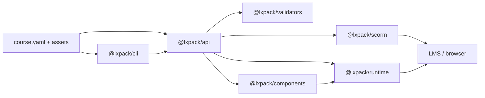

# LXPack

[](https://lxpack.readthedocs.io/en/latest/?badge=latest)
[](https://github.com/eddiethedean/lxpack/actions/workflows/ci.yml)
[](https://github.com/eddiethedean/lxpack/actions/workflows/release.yml)
[](https://www.npmjs.com/package/@lxpack/cli)
[](https://github.com/eddiethedean/lxpack/blob/main/LICENSE)
[](https://nodejs.org/)

**AI-native learning experience compiler and runtime** — build web-native courses from declarative manifests, preview them locally, validate structure with schemas, and export SCORM 1.2, SCORM 2004, xAPI, cmi5, or standalone packages for your LMS.

**Documentation:** [lxpack.readthedocs.io](https://lxpack.readthedocs.io/en/latest/) — install, workflows, course authoring, CLI reference, and copy-paste prompts for Claude and Cursor.

LXPack treats courses as programmable learning applications (markdown lessons, HTML interactions, reusable components, branching flow, YAML assessments), not slide decks. It is designed for AI-assisted authoring workflows (Claude Code, Claude Design) and enterprise LMS deployment.

**Current release:** [v0.6.2](https://github.com/eddiethedean/lxpack/blob/main/CHANGELOG.md) — Node.js 18 and 20 support

## Packages

| Package | npm | README | Docs |
|---------|-----|--------|------|
| `@lxpack/cli` | [npm](https://www.npmjs.com/package/@lxpack/cli) | [packages/cli](packages/cli/README.md) | [CLI](https://lxpack.readthedocs.io/en/latest/reference/cli/) |
| `@lxpack/api` | [npm](https://www.npmjs.com/package/@lxpack/api) | [packages/api](packages/api/README.md) | [LessonKit interoperability](https://lxpack.readthedocs.io/en/latest/guides/lessonkit-interoperability/) |
| `@lxpack/runtime` | [npm](https://www.npmjs.com/package/@lxpack/runtime) | [packages/runtime](packages/runtime/README.md) | [Lesson types](https://lxpack.readthedocs.io/en/latest/reference/lesson-types/) |
| `@lxpack/validators` | [npm](https://www.npmjs.com/package/@lxpack/validators) | [packages/validators](packages/validators/README.md) | [course.yaml](https://lxpack.readthedocs.io/en/latest/reference/course-yaml/) |
| `@lxpack/scorm` | [npm](https://www.npmjs.com/package/@lxpack/scorm) | [packages/scorm](packages/scorm/README.md) | [Export to LMS](https://lxpack.readthedocs.io/en/latest/guides/export-to-lms/) |
| `@lxpack/components` | [npm](https://www.npmjs.com/package/@lxpack/components) | [packages/components](packages/components/README.md) | [Components](https://lxpack.readthedocs.io/en/latest/reference/components/) |
| `@lxpack/tracking-schema` | [npm](https://www.npmjs.com/package/@lxpack/tracking-schema) | [packages/tracking-schema](packages/tracking-schema/README.md) | [Tracking](https://lxpack.readthedocs.io/en/latest/reference/tracking-and-completion/) |
| `@lxpack/xapi` | [npm](https://www.npmjs.com/package/@lxpack/xapi) | [packages/xapi](packages/xapi/README.md) | [Tracking](https://lxpack.readthedocs.io/en/latest/reference/tracking-and-completion/) |
| `@lxpack/cmi5` | [npm](https://www.npmjs.com/package/@lxpack/cmi5) | [packages/cmi5](packages/cmi5/README.md) | [Export to LMS](https://lxpack.readthedocs.io/en/latest/guides/export-to-lms/) |
| `@lxpack/spa-bridge` | [npm](https://www.npmjs.com/package/@lxpack/spa-bridge) | [packages/spa-bridge](packages/spa-bridge/README.md) | [SPA bridge](https://lxpack.readthedocs.io/en/latest/reference/spa-bridge/) |
| `@lxpack/lessonkit` | [npm](https://www.npmjs.com/package/@lxpack/lessonkit) | [packages/lessonkit](packages/lessonkit/README.md) | [LessonKit interoperability](https://lxpack.readthedocs.io/en/latest/guides/lessonkit-interoperability/) |
| `@lxpack/conformance` | [npm](https://www.npmjs.com/package/@lxpack/conformance) | [packages/conformance](packages/conformance/README.md) | [Developer docs](https://lxpack.readthedocs.io/en/latest/developer/) |

## Features

- **Authoring** — `course.yaml` manifest; markdown, HTML, component, and **SPA** lessons; YAML assessments; optional variables and branching `flow`
- **Validation & preview** — schema checks, path containment; local preview with optional SCORM 1.2/2004 simulators ([config](https://lxpack.readthedocs.io/en/latest/reference/lxpack-config/))
- **Export** — SCORM 1.2, SCORM 2004 (multi-SCO), standalone, xAPI, and cmi5 (`lxpack build --target …`)
- **Runtime** — navigation, MCQ engine, HTML interactions, SPA iframe lessons with parent **bridge API**, SCORM 1.2/2004 APIs, xAPI analytics
- **Programmatic API** — `@lxpack/api` for validate/build from Node (LessonKit and other toolchains); optional `lessonkit.json` interchange metadata
- **Components** — built-in widgets (`callout`, `image-card`, `checklist`)
- **Theming** — optional `runtime.cssVariables` in `course.yaml` applied to the learner shell
- **Packaging** — quiz keys embedded at build; author `assessments/*.yaml` not shipped in learner ZIPs

## Requirements

- [Node.js](https://nodejs.org/) **18 or 20** (18+) — see [What you need](https://lxpack.readthedocs.io/en/latest/getting-started/what-you-need/)
- [pnpm](https://pnpm.io/) **9.15** (see `packageManager` in `package.json`) — for developing LXPack from source

## Install

Author guide: [Install the CLI](https://lxpack.readthedocs.io/en/latest/getting-started/install-cli/).

```bash
npm install -g @lxpack/cli
# or: pnpm add -g @lxpack/cli
```

Then scaffold a course from any directory:

```bash
lxpack init my-course
cd my-course
lxpack preview
```

## Quick start (from source)

Step-by-step for new authors: [Your first course](https://lxpack.readthedocs.io/en/latest/getting-started/your-first-course/). From the repository root:

```bash
corepack enable
pnpm install
pnpm build

# Scaffold a new course
pnpm exec lxpack init my-course
cd my-course

# Preview (run from the course directory)
pnpm exec lxpack preview

# Validate and export
pnpm exec lxpack validate
pnpm exec lxpack build --target scorm12
pnpm exec lxpack build --target scorm2004
pnpm exec lxpack build --target xapi
pnpm exec lxpack build --target cmi5
```

Build artifacts are written under `.lxpack/` by default (for example `.lxpack/my-course-scorm12.zip`, `.lxpack/my-course-xapi.zip`, or `.lxpack/my-course-cmi5.zip`).

### Example courses

Walkthrough of the sample courses: [Build courses overview](https://lxpack.readthedocs.io/en/latest/guides/build-overview/).

**Security awareness (linear, SCORM 1.2):**

```bash
pnpm build
cd examples/security-awareness
pnpm exec lxpack preview
pnpm exec lxpack validate
pnpm exec lxpack build --target scorm12
```

**Branching demo (variables, flow, components, SCORM 2004):**

```bash
cd examples/branching-demo
pnpm exec lxpack preview
pnpm exec lxpack validate
pnpm exec lxpack build --target scorm2004
```

**xAPI / cmi5 (requires `tracking.xapi.activityIri`):** see [Tracking and completion](https://lxpack.readthedocs.io/en/latest/reference/tracking-and-completion/).

```bash
cd examples/xapi-awareness
pnpm exec lxpack validate --target xapi
pnpm exec lxpack build --target xapi

cd examples/cmi5-demo
pnpm exec lxpack validate --target cmi5
pnpm exec lxpack build --target cmi5
```

**LessonKit SPA (built app folder + bridge API):**

```bash
cd examples/lessonkit-spa
pnpm exec lxpack validate
pnpm exec lxpack build --target scorm12
```

See [LessonKit interoperability](https://lxpack.readthedocs.io/en/latest/guides/lessonkit-interoperability/).

## Programmatic API

For integrations that should not shell out to the CLI, use `@lxpack/api`:

```ts
import { validateCourse, buildCourse } from "@lxpack/api";

const validation = await validateCourse({ courseDir: "./my-course", target: "scorm2004" });
if (!validation.ok) throw new Error("invalid course");

await buildCourse({ courseDir: "./my-course", target: "scorm2004", output: ".lxpack/course.zip" });
```

Optional `lessonkit.json` at the course root merges SPA lesson metadata before validate/build. You can also pass in-memory `assessments` to `buildCourse` when YAML files should not live on disk.

## CLI reference

Full option list and behavior: [CLI reference](https://lxpack.readthedocs.io/en/latest/reference/cli/).

| Command | Description |
|---------|-------------|
| `lxpack init <name>` | Scaffold a new course (`-d, --dir`, `-f, --force`) |
| `lxpack preview` | Start local preview server (`-p, --port`, `-H, --host`) |
| `lxpack validate` | Validate `course.yaml` and referenced files (`-t, --target` for export-specific checks) |
| `lxpack build` | Package for LMS or standalone export |

### `build` options

| Option | Description |
|--------|-------------|
| `-t, --target <target>` | `scorm12` (default), `scorm2004`, `standalone`, `xapi`, or `cmi5` |
| `-o, --output <path>` | Output ZIP file or directory |
| `--dir` | Write an unpacked directory instead of a ZIP |

Examples:

```bash
lxpack build --target scorm12
lxpack build --target scorm2004
lxpack build --target standalone -o ./dist/course.zip
lxpack build --target standalone --dir -o ./dist/standalone
lxpack build --target xapi
lxpack build --target cmi5
lxpack validate --target xapi
```

Commands discover the course by walking up from the current directory until they find `course.yaml`. `init --dir` and `lxpack.config.json` `output.dir` are resolved with path containment (no escapes outside the project).

## Course structure

Folder layout and manifest fields: [Course structure](https://lxpack.readthedocs.io/en/latest/guides/course-structure/) · [course.yaml reference](https://lxpack.readthedocs.io/en/latest/reference/course-yaml/) · [lxpack.config.json](https://lxpack.readthedocs.io/en/latest/reference/lxpack-config/).

```text
my-course/
  course.yaml          # Course manifest (required)
  lxpack.config.json   # Optional: defaultTarget, output dir
  lessons/             # Markdown lesson files
  interactions/        # HTML/JS interaction folders (index.html)
  spa/                 # Optional: SPA lesson build output (folders with index.html)
  assessments/         # Quiz YAML (authoring only — not in export ZIPs)
  components/          # Optional overrides for @lxpack/components widgets
  assets/              # Static assets
  theme/               # Optional theme assets (reserved; `runtime.theme` sets a CSS class on the app root)
  .lxpack/             # Build output (generated)
```

### Example `course.yaml` (branching)

```yaml
title: My Course
version: 1.0.0

variables:
  track:
    default: basic
    type: string

flow:
  - when:
      variable:
        eq: [track, advanced]
    goto: advanced_lab
  - when:
      assessment:
        passed: final_quiz
    goto: wrap_up

lessons:
  - id: intro
    title: Introduction
    type: markdown
    file: lessons/intro.md

  - id: advanced_lab
    title: Advanced path
    type: component
    component: callout
    props:
      variant: info
      body: You unlocked the advanced track.

  - id: wrap_up
    title: Wrap up
    type: markdown
    file: lessons/wrap-up.md

assessments:
  - id: final_quiz
    file: assessments/final.yaml

tracking:
  completion:
    threshold: 0.9
```

### Lesson types

Details: [Lesson types](https://lxpack.readthedocs.io/en/latest/reference/lesson-types/) · [Writing lessons](https://lxpack.readthedocs.io/en/latest/guides/writing-lessons/) · [Building interactions](https://lxpack.readthedocs.io/en/latest/guides/building-interactions/) · [Components](https://lxpack.readthedocs.io/en/latest/reference/components/).

| Type | Fields | Description |
|------|--------|-------------|
| `markdown` | `file` | Markdown lesson under `lessons/` |
| `html` | `path` | Folder with `index.html` under `interactions/` |
| `spa` | `path` | Folder with `index.html` (e.g. Vite/React build output); use `window.parent.lxpackBridge.v1` for progress |
| `component` | `component`, optional `props` | Built-in or course override widget from `@lxpack/components` |

SPA lessons are rendered in an iframe. Report completion and assessments via the parent bridge:

```js
window.parent?.lxpackBridge?.v1?.completeLesson("my_spa_lesson");
window.parent?.lxpackBridge?.v1?.track({ type: "interaction", id: "clicked" });
```

### Assessment options (author YAML)

Quiz authoring: [Quizzes and assessments](https://lxpack.readthedocs.io/en/latest/guides/quizzes-and-assessments/).

```yaml
id: final_quiz
title: Final Quiz
passingScore: 0.7
maxAttempts: 3
shuffleChoices: true
showFeedback: immediate
questions:
  - id: q1
    prompt: What is LXPack?
    explanation: LXPack compiles web-native courses for LMS deployment.
    choices:
      - id: a
        text: A learning experience compiler
        correct: true
```

## Architecture



```text
packages/
  cli/              @lxpack/cli              — init, preview, validate, build
  api/              @lxpack/api              — programmatic validate/build
  runtime/          @lxpack/runtime          — browser client, flow, SCORM APIs, quiz, SPA bridge
  validators/       @lxpack/validators       — Zod schemas, validateCourse, bundles
  scorm/            @lxpack/scorm            — SCORM / standalone / xAPI / cmi5 packaging
  components/       @lxpack/components       — reusable lesson widgets
  tracking-schema/  @lxpack/tracking-schema  — canonical track() event types
  xapi/             @lxpack/xapi             — xAPI statements, transport, Tin Can XML
  cmi5/             @lxpack/cmi5             — cmi5.xml generation
examples/
  security-awareness/   — linear SCORM 1.2 sample
  branching-demo/       — variables, flow, components, SCORM 2004
  lessonkit-spa/        — SPA lesson + bridge API sample
  xapi-awareness/       — xAPI export sample
  cmi5-demo/            — cmi5 export sample
test/
  fixtures/             — shared validation/build test courses
docs/               # MkDocs source → https://lxpack.readthedocs.io/
library-skills/     # Agent Skills — see [Library Skills](https://lxpack.readthedocs.io/en/latest/guides/library-skills/)
```

Monorepo architecture: [Architecture](https://lxpack.readthedocs.io/en/latest/developer/ARCHITECTURE/) · [Technical specification](https://lxpack.readthedocs.io/en/latest/developer/SPEC/).

## Security notes

Operational guidance: [Troubleshooting](https://lxpack.readthedocs.io/en/latest/reference/troubleshooting/).

- **Assessments:** Author YAML under `assessments/` stays in the repo for editing. Exports embed learner-safe questions, answer keys, quiz config, and feedback text in the HTML config JSON (not as fetchable files). SCORM 2004 slices keys per SCO; SCORM 1.2, standalone, xAPI, and cmi5 use a single launch page with all keys (required for client-side scoring).
- **Embedded JSON:** Config injected into HTML escapes `<` and `>` to prevent `</script>` breakout.
- **HTML interactions:** Custom HTML under `interactions/` is trusted author content. Iframes use `allow-same-origin` so labs can call `window.parent.lxpack` or `window.parent.lxpackBridge.v1`; malicious interaction HTML could read parent config including answer keys.
- **SPA lessons:** Same iframe model as HTML labs. Prefer `lxpackBridge.v1` over direct `window.lxpack` (validators warn on the latter in SPA `index.html`).
- **Path containment:** Validation, preview, and packaging resolve paths inside the course directory; symlinks that escape the course root are rejected. Preview blocks normalized traversal to author-only files.
- **Markdown:** Rendered through a DOMPurify allowlist in the browser runtime. Custom HTML under `interactions/` is trusted author content (not sandboxed).
- **SCORM 2004:** Sequencing uses a supported IMS Simple Sequencing subset; validate packages in SCORM Cloud or Moodle before production rollout.

## Development

Contributor docs: [Developer hub](https://lxpack.readthedocs.io/en/latest/developer/).

```bash
pnpm install
pnpm build          # build all packages (required before preview; `pnpm test` runs this via pretest)
pnpm lint           # ESLint on package sources
pnpm typecheck      # TypeScript per package
pnpm test           # Vitest across packages
pnpm test:coverage  # coverage thresholds per package
pnpm examples:validate  # validate all courses under examples/ (requires build)
```

### Preview SCORM simulation

See [Preview and review](https://lxpack.readthedocs.io/en/latest/guides/preview-and-review/) and [lxpack.config.json](https://lxpack.readthedocs.io/en/latest/reference/lxpack-config/).

In `lxpack.config.json`:

```json
{
  "preview": {
    "scormMode": "local"
  }
}
```

| `scormMode` | Behavior |
|-------------|----------|
| `local` (default) | Progress in `localStorage` (no SCORM API on `window`) |
| `scorm12` | SCORM 1.2 simulator (`window.API`, `cmi.suspend_data` in `localStorage`) |
| `scorm2004` | SCORM 2004 simulator (`window.API_1484_11`) |

Run a single package:

```bash
pnpm --filter @lxpack/validators test
pnpm --filter @lxpack/cli build
```

## CI and releases

| Workflow | Trigger | Steps |
|----------|---------|--------|
| [CI](https://github.com/eddiethedean/lxpack/blob/main/.github/workflows/ci.yml) | Push/PR to `main` or `master` | lint, build, typecheck, test |
| [Checks](https://github.com/eddiethedean/lxpack/blob/main/.github/workflows/checks.yml) | Reusable / release | lint, build, typecheck, test, **coverage** |
| [Release](https://github.com/eddiethedean/lxpack/blob/main/.github/workflows/release.yml) | Tag `v*.*.*` | checks, then publish all `@lxpack/*` packages to npm |

To cut a release:

1. Bump versions and update [CHANGELOG.md](CHANGELOG.md).
2. Ensure the GitHub secret `NPM_TOKEN` is set for the npm user that owns `@lxpack/*` (e.g. `eddiethedean`):
   - **Classic automation token** (recommended for CI), or
   - **Granular token** with **Read and write** on `@lxpack/*` and **Bypass 2FA for publish** enabled.
   The release workflow passes this token to `setup-node` so `.npmrc` is authenticated before `pnpm publish`.
3. Tag and push: `git tag vX.Y.Z && git push origin vX.Y.Z`

The release workflow runs all CI checks before publishing. See [CHANGELOG.md](CHANGELOG.md) for release notes.

## Roadmap

Planned work and phase history: [Roadmap](https://lxpack.readthedocs.io/en/latest/developer/ROADMAP/) · [Product plan](https://lxpack.readthedocs.io/en/latest/developer/PLAN/).

## Documentation

**[lxpack.readthedocs.io](https://lxpack.readthedocs.io/en/latest/)** — searchable docs with copy buttons on commands and prompts.

| Audience | Start here |
|----------|------------|
| Everyone new | [Get started](https://lxpack.readthedocs.io/en/latest/getting-started/) |
| Instructional designers | [Claude Design workflow](https://lxpack.readthedocs.io/en/latest/guides/workflow-claude-design/) · [Prompts](https://lxpack.readthedocs.io/en/latest/guides/prompts-for-claude/) |
| Migrating from Storyline / Rise / HTML | [Legacy migration](https://lxpack.readthedocs.io/en/latest/guides/migrating-from-legacy-tools/) · [HTML → LXPack prompts](https://lxpack.readthedocs.io/en/latest/guides/prompts-for-claude/#migration-from-legacy-tools) |
| LessonKit / React SPAs | [LessonKit interoperability](https://lxpack.readthedocs.io/en/latest/guides/lessonkit-interoperability/) |
| Cursor (no Claude) | [Cursor workflow](https://lxpack.readthedocs.io/en/latest/guides/workflow-cursor/) |
| Developers | [Claude Code workflow](https://lxpack.readthedocs.io/en/latest/guides/workflow-claude-code/) · [Developer docs](https://lxpack.readthedocs.io/en/latest/developer/) |
| AI agents | [Library Skills](https://lxpack.readthedocs.io/en/latest/guides/library-skills/) |

- [Changelog](CHANGELOG.md)
- [Export to LMS](https://lxpack.readthedocs.io/en/latest/guides/export-to-lms/)
- [Branching and paths](https://lxpack.readthedocs.io/en/latest/guides/branching-and-paths/)
- [Tracking and completion](https://lxpack.readthedocs.io/en/latest/reference/tracking-and-completion/)
- [Read the Docs setup](https://lxpack.readthedocs.io/en/latest/readthedocs-setup/) (maintainers)

## License

Apache-2.0
