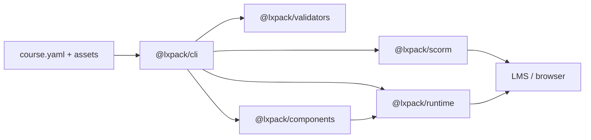

# LXPack

[](https://github.com/eddiethedean/lxpack/actions/workflows/ci.yml)
[](https://github.com/eddiethedean/lxpack/actions/workflows/release.yml)
[](https://www.npmjs.com/package/@lxpack/cli)
[](https://github.com/eddiethedean/lxpack/blob/main/LICENSE)
[](https://nodejs.org/)

**AI-native learning experience compiler and runtime** — build web-native courses from declarative manifests, preview them locally, validate structure with schemas, and export SCORM 1.2, SCORM 2004, or standalone packages for your LMS.

LXPack treats courses as programmable learning applications (markdown lessons, HTML interactions, reusable components, branching flow, YAML assessments), not slide decks. It is designed for AI-assisted authoring workflows (Claude Code, Claude Design) and enterprise LMS deployment.

**Current release:** [v0.2.2](https://github.com/eddiethedean/lxpack/blob/main/CHANGELOG.md#022---2026-05-24)

## Packages

| Package | npm | README |
|---------|-----|--------|
| `@lxpack/cli` | [npm](https://www.npmjs.com/package/@lxpack/cli) | [packages/cli](packages/cli/README.md) |
| `@lxpack/runtime` | [npm](https://www.npmjs.com/package/@lxpack/runtime) | [packages/runtime](packages/runtime/README.md) |
| `@lxpack/validators` | [npm](https://www.npmjs.com/package/@lxpack/validators) | [packages/validators](packages/validators/README.md) |
| `@lxpack/scorm` | [npm](https://www.npmjs.com/package/@lxpack/scorm) | [packages/scorm](packages/scorm/README.md) |
| `@lxpack/components` | [npm](https://www.npmjs.com/package/@lxpack/components) | [packages/components](packages/components/README.md) |

## Features

### Core (v0.1.x)

- **Declarative manifests** — `course.yaml` defines lessons, interactions, assessments, and tracking rules
- **Schema validation** — Zod-powered checks for manifest shape, symlink-safe path containment, and on-disk assets
- **Browser runtime** — lesson navigation, markdown rendering, HTML interactions, MCQ assessments, progress tracking
- **Secure packaging** — assessment answer keys and feedback text are embedded in the runtime config at build time; author `assessments/*.yaml` files are not shipped in exported ZIPs
- **SCORM 1.2** — single-SCO export; discovers the LMS `API` in parent/opener frames; compact `suspend_data` within the 4096-character limit
- **Local preview** — Fastify dev server with strict validation (same rules as `build`)
- **Export targets** — SCORM 1.2 ZIP, standalone HTML ZIP/directory
- **Course config** — optional `lxpack.config.json` for default export target and output directory

### Runtime expansion (v0.2.0)

- **Manifest variables** — declare defaults in `course.yaml`; read/write via `lxpack.setVariable()` / `getVariable()` with `v:` namespacing in suspend data
- **Flow & branching** — ordered `flow` rules with a small condition language (`variable.eq`, `assessment.passed`, `interaction.done`, `all` / `any`); linear navigation when `flow` is omitted
- **Quiz engine** — per-assessment `maxAttempts`, `shuffleChoices`, and `showFeedback` (`immediate` | `end` | `never`)
- **`@lxpack/components`** — built-in widgets (`callout`, `image-card`, `checklist`) and `type: component` lessons
- **SCORM 2004** — multi-SCO packages with per-activity launch pages (`sco/<id>/index.html`), shared runtime bundle, and IMS Simple Sequencing subset in `imsmanifest.xml`
- **SCORM 2004 API** — `API_1484_11` discovery, CMI mapping, and preview simulator

## Requirements

- [Node.js](https://nodejs.org/) **20+**
- [pnpm](https://pnpm.io/) **9.15** (see `packageManager` in `package.json`) — for developing LXPack from source

## Install

```bash
npm install -g @lxpack/cli
# or: pnpm add -g @lxpack/cli
```

Then scaffold a course from any directory:

```bash
lxpack init my-course
cd my-course
lxpack preview
```

## Quick start (from source)

From the repository root:

```bash
corepack enable
pnpm install
pnpm build

# Scaffold a new course
pnpm exec lxpack init my-course
cd my-course

# Preview (run from the course directory)
pnpm exec lxpack preview

# Validate and export
pnpm exec lxpack validate
pnpm exec lxpack build --target scorm12
pnpm exec lxpack build --target scorm2004
```

Build artifacts are written under `.lxpack/` by default (for example `.lxpack/my-course-scorm12.zip` or `.lxpack/my-course-scorm2004.zip`).

### Example courses

**Security awareness (linear, SCORM 1.2):**

```bash
pnpm build
cd examples/security-awareness
pnpm exec lxpack preview
pnpm exec lxpack validate
pnpm exec lxpack build --target scorm12
```

**Branching demo (variables, flow, components, SCORM 2004):**

```bash
cd examples/branching-demo
pnpm exec lxpack preview
pnpm exec lxpack validate
pnpm exec lxpack build --target scorm2004
```

## CLI reference

| Command | Description |
|---------|-------------|
| `lxpack init <name>` | Scaffold a new course (`-d, --dir`, `-f, --force`) |
| `lxpack preview` | Start local preview server (`-p, --port`, `-H, --host`) |
| `lxpack validate` | Validate `course.yaml` and referenced files |
| `lxpack build` | Package for LMS or standalone export |

### `build` options

| Option | Description |
|--------|-------------|
| `-t, --target <target>` | `scorm12` (default), `scorm2004`, or `standalone` |
| `-o, --output <path>` | Output ZIP file or directory |
| `--dir` | Write an unpacked directory instead of a ZIP |

Examples:

```bash
lxpack build --target scorm12
lxpack build --target scorm2004
lxpack build --target standalone -o ./dist/course.zip
lxpack build --target standalone --dir -o ./dist/standalone
```

Commands discover the course by walking up from the current directory until they find `course.yaml`. `init --dir` and `lxpack.config.json` `output.dir` are resolved with path containment (no escapes outside the project).

## Course structure

```text
my-course/
  course.yaml          # Course manifest (required)
  lxpack.config.json   # Optional: defaultTarget, output dir
  lessons/             # Markdown lesson files
  interactions/        # HTML/JS interaction folders (index.html)
  assessments/         # Quiz YAML (authoring only — not in export ZIPs)
  components/          # Optional overrides for @lxpack/components widgets
  assets/              # Static assets
  theme/               # Optional theme assets (not wired in v0.2.x)
  .lxpack/             # Build output (generated)
```

### Example `course.yaml` (v0.2 features)

```yaml
title: My Course
version: 1.0.0

variables:
  track:
    default: basic
    type: string

flow:
  - when:
      variable:
        eq: [track, advanced]
    goto: advanced_lab
  - when:
      assessment:
        passed: final_quiz
    goto: wrap_up

lessons:
  - id: intro
    title: Introduction
    type: markdown
    file: lessons/intro.md

  - id: advanced_lab
    title: Advanced path
    type: component
    component: callout
    props:
      variant: info
      body: You unlocked the advanced track.

  - id: wrap_up
    title: Wrap up
    type: markdown
    file: lessons/wrap-up.md

assessments:
  - id: final_quiz
    file: assessments/final.yaml

tracking:
  completion:
    threshold: 0.9
```

### Lesson types

| Type | Fields | Description |
|------|--------|-------------|
| `markdown` | `file` | Markdown lesson under `lessons/` |
| `html` | `path` | Folder with `index.html` under `interactions/` |
| `component` | `component`, optional `props` | Built-in or course override widget from `@lxpack/components` |

### Assessment options (author YAML)

```yaml
id: final_quiz
title: Final Quiz
passingScore: 0.7
maxAttempts: 3
shuffleChoices: true
showFeedback: immediate
questions:
  - id: q1
    prompt: What is LXPack?
    explanation: LXPack compiles web-native courses for LMS deployment.
    choices:
      - id: a
        text: A learning experience compiler
        correct: true
```

## Architecture



```text
packages/
  cli/          @lxpack/cli         — init, preview, validate, build
  runtime/      @lxpack/runtime     — browser client, flow, SCORM APIs, quiz
  validators/   @lxpack/validators  — Zod schemas, validateCourse, bundles
  scorm/        @lxpack/scorm       — SCORM 1.2 / 2004 / standalone packaging
  components/   @lxpack/components  — reusable lesson widgets
examples/
  security-awareness/   — linear SCORM 1.2 sample
  branching-demo/       — variables, flow, components, SCORM 2004
test/
  fixtures/             — shared validation/build test courses
docs/
  README.md, SPEC.md, PLAN.md, ROADMAP.md
```

## Security notes

- **Assessments:** Author YAML under `assessments/` stays in the repo for editing. Exports embed learner-safe questions, answer keys, quiz config, and feedback text in the HTML config JSON (not as fetchable files).
- **Embedded JSON:** Config injected into HTML escapes `<` to prevent `</script>` breakout.
- **Path containment:** Validation and CLI resolve paths inside the course directory; symlinks that escape the course root are rejected.
- **Markdown:** Rendering uses a basic sanitizer. Only use trusted author content until DOMPurify support lands.
- **SCORM 2004:** Sequencing uses a supported IMS Simple Sequencing subset; validate packages in SCORM Cloud or Moodle before production rollout.

## Development

```bash
pnpm install
pnpm build          # build all packages (required before preview; `pnpm test` runs this via pretest)
pnpm lint           # ESLint on package sources
pnpm typecheck      # TypeScript per package
pnpm test           # Vitest across packages
pnpm test:coverage  # coverage thresholds per package
```

Run a single package:

```bash
pnpm --filter @lxpack/validators test
pnpm --filter @lxpack/cli build
```

## CI and releases

| Workflow | Trigger | Steps |
|----------|---------|--------|
| [CI](https://github.com/eddiethedean/lxpack/blob/main/.github/workflows/ci.yml) | Push/PR to `main` or `master` | lint, build, typecheck, test |
| [Release](https://github.com/eddiethedean/lxpack/blob/main/.github/workflows/release.yml) | Tag `v*.*.*` | checks, then publish all `@lxpack/*` packages to npm |

To cut a release:

1. Bump versions and update [CHANGELOG.md](CHANGELOG.md).
2. Ensure the GitHub secret `NPM_TOKEN` is set for the npm user that owns `@lxpack/*` (e.g. `eddiethedean`):
   - **Classic automation token** (recommended for CI), or
   - **Granular token** with **Read and write** on `@lxpack/*` and **Bypass 2FA for publish** enabled.
   The release workflow passes this token to `setup-node` so `.npmrc` is authenticated before `pnpm publish`.
3. Tag and push: `git tag v0.2.2 && git push origin v0.2.2`

The release workflow runs all CI checks before publishing. See [CHANGELOG.md](CHANGELOG.md) for release notes.

## Roadmap

| Phase | Version | Status |
|-------|---------|--------|
| 1 — MVP | **v0.1.x** (latest **v0.1.1**) | Shipped — CLI, validation, preview, SCORM 1.2, standalone HTML, MCQ assessments |
| 2 — Runtime expansion | **v0.2.x** (latest **v0.2.2**) | Shipped — SCORM 2004 multi-SCO, branching, variables, quiz engine, `@lxpack/components` |
| 3 — Modern standards | v0.3.0 | Shipped — xAPI, cmi5, analytics hooks |
| 4–6 | TBD | AI tooling, ecosystem, enterprise platform |

Details: [docs/ROADMAP.md](docs/ROADMAP.md) (canonical phases), [docs/PLAN.md](docs/PLAN.md), [docs/README.md](docs/README.md).

## Documentation

- [Documentation index](docs/README.md) — release phases and package map
- [Changelog](CHANGELOG.md)
- [Technical Specification](docs/SPEC.md)
- [Product Plan](docs/PLAN.md)
- [Roadmap](docs/ROADMAP.md)

## License

Apache-2.0
