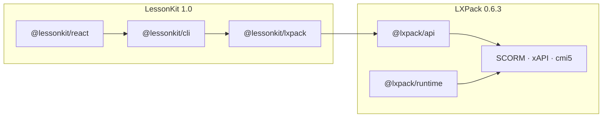

# LessonKit interoperability (LXPack 0.6.3+)

[LXPack](https://github.com/eddiethedean/lxpack) validates and packages [LessonKit](https://github.com/eddiethedean/lessonkit) React courses for LMS delivery. **`@lessonkit/lxpack`** is the adapter between the two.

Requires **Node.js 18+** and LXPack **`@lxpack/api` 0.6.3+**.

**LessonKit current release:** [1.0.0](https://github.com/eddiethedean/lessonkit) · npm `@lessonkit/*` · docs [lessonkit.readthedocs.io](https://lessonkit.readthedocs.io/en/latest/)

## Who uses what

| You are… | Start here |
|----------|------------|
| **React / Vite author** (recommended) | [LessonKit](https://github.com/eddiethedean/lessonkit) — `npx @lessonkit/cli init`, `lessonkit dev`, `lessonkit package --target scorm12` |
| **Instructional designer / YAML author** | LXPack — `lxpack init`, markdown/HTML lessons, `lxpack build` |
| **Integrator / CI** | `@lessonkit/lxpack` (`packageLessonkitCourse`) or `@lxpack/api` (`packageLessonkit`) |

## Workflow

1. **Author** a React app with stable `courseId`, `lessonId`, and `checkId` props (`@lessonkit/react`).
2. **Describe** the course in a `LessonkitCourseDescriptor` or root **`lessonkit.json`** (`schemaVersion: 1`).
3. **Build** the Vite app (`lessonkit build` → `dist/`).
4. **Package** with `lessonkit package` or `packageLessonkitCourse()`.

```bash
npx @lessonkit/cli init my-course
cd my-course
lessonkit dev
lessonkit build
lessonkit package --target scorm12
```

Programmatic packaging:

```ts
import { packageLessonkitCourse } from "@lessonkit/lxpack";

const result = await packageLessonkitCourse({
  descriptor: myCourseDescriptor,
  outDir: ".lxpack/course",
  spaDistDir: "dist",
  target: "scorm12",
  output: ".lxpack/out/course-scorm12.zip",
});

if (!result.ok) {
  console.error(result.issues);
  process.exit(1);
}
```

See LessonKit docs: [packaging](https://lessonkit.readthedocs.io/en/latest/reference/packaging.html) · [CLI](https://lessonkit.readthedocs.io/en/latest/reference/cli.html) · [LXPack bridge](https://lessonkit.readthedocs.io/en/latest/reference/lxpack-bridge.html) · [golden example](https://github.com/eddiethedean/lessonkit/tree/main/examples/lxpack-golden).

## How it fits together



## LXPack-native workflow (no React)

For manifest-driven courses (`course.yaml`, markdown, HTML, components), use the **`lxpack`** CLI directly.

For **interchange-only** SPA projects (no hand-written `course.yaml`):

```bash
lxpack build --lessonkit ./lessonkit.json \
  --spa-lesson intro_spa=/abs/path/to/dist \
  --target scorm12
```

Or programmatically:

```ts
import { packageLessonkit } from "@lxpack/api";

await packageLessonkit({
  configDir: "/path/to/project",
  interchange: { /* LXPack v1 interchange */ },
  spaDirs: { intro_spa: "/abs/path/to/dist" },
  target: "scorm12",
});
```

## SPA layouts

### `single-spa` (recommended default)

One Vite build, one `type: spa` lesson in the LXPack project. Multi-lesson navigation stays inside your React app.

- Set `layout: "single-spa"` on the descriptor.
- Copy source from `spaDistDir` (default `dist`) into `{outDir}/dist`.

```yaml
lessons:
  - id: phishing_101
    title: Phishing Awareness
    type: spa
    path: dist/lessons/phishing-101
```

### `per-lesson-spa`

One build output per lesson (multi-SCO friendly).

- Set `layout: "per-lesson-spa"`.
- Each lesson needs `spaPath` (e.g. `dist/lessons/intro`).
- Pass `lessonSpaDirs: { intro: "/abs/path/to/build" }` to `packageLessonkitCourse`.

See [SCORM SPA recipes](../guides/scorm-spa-recipes.md).

## LMS bridge (iframe)

When the SPA runs inside LXPack, call the parent bridge (or rely on `@lessonkit/react`, which forwards completion events when `window.parent.lxpackBridge.v1` exists):

```ts
import { notifyLxpackLessonComplete } from "@lessonkit/lxpack/bridge";

notifyLxpackLessonComplete("intro");
```

Direct calls (or non-React SPAs):

```js
import { getLxpackBridge } from "@lxpack/spa-bridge";

const bridge = getLxpackBridge();
bridge?.completeLesson("phishing_101");
bridge?.submitAssessment({ id: "final_quiz", score: 0.9, passingScore: 0.7 });
```

Disable forwarding: `config.lxpack.bridge = "off"` on `LessonkitProvider`. See [SPA bridge reference](spa-bridge.md).

## Interchange metadata (`lessonkit.json`)

Two related shapes:

| Source | Shape | Parsed by |
|--------|--------|-----------|
| **LessonKit project manifest** | `schemaVersion: 1` at repo root | `@lessonkit/lxpack` (`parseLessonkitManifest`) |
| **LXPack interchange** | `"format": "lessonkit"`, `"version": "1"` | `@lxpack/validators`, `@lxpack/api`, `lxpack` CLI |

`@lessonkit/lxpack` emits LXPack-compatible interchange when materializing projects. See [lessonkit interchange reference](lessonkit-interchange.md).

## Telemetry mapping

LessonKit telemetry event names map to LXPack `track()` via `mapLessonkitTelemetryToLxpack` from `@lxpack/tracking-schema` (re-exported by `@lxpack/lessonkit` and used in `@lessonkit/lxpack/bridge`).

## Package map

| LessonKit (1.0) | LXPack (0.6.3) | Role |
|-----------------|----------------|------|
| `@lessonkit/react` | — | React components, hooks, `ThemeProvider` |
| `@lessonkit/core` | — | Identity, telemetry catalog |
| `@lessonkit/xapi` | `@lxpack/xapi` | xAPI (author-time vs export-time) |
| `@lessonkit/lxpack` | `@lxpack/api` | Descriptor → materialize → build |
| `@lessonkit/cli` | `@lxpack/cli` | Author CLI vs low-level LXPack CLI |
| — | `@lxpack/spa-bridge` | Typed iframe bridge SDK |
| — | `@lxpack/lessonkit` | LXPack meta-package (API + bridge re-exports) |
| — | `@lxpack/conformance` | Shared export-target matrix for CI |

See [LessonKit and LXPack packages](lessonkit-packages.md).

## Conformance

LessonKit runs LXPack conformance in CI (`npm run conformance:lxpack`). LXPack maintainers:

```bash
pnpm --filter @lxpack/conformance test
```

Validate against the golden example:

```bash
git clone https://github.com/eddiethedean/lessonkit.git
cd lessonkit && npm ci && npm run build
npm -w lessonkit-example-lxpack-golden run package:scorm12
```

## Related

- [LessonKit repository](https://github.com/eddiethedean/lessonkit)
- [LessonKit documentation](https://lessonkit.readthedocs.io/en/latest/)
- [LessonKit and LXPack packages](lessonkit-packages.md)
- [lessonkit.json interchange](lessonkit-interchange.md)
- [LXPack upgrades for LessonKit](lxpack-upgrades.md#historical-checklist-lessonkit-team) (historical checklist)
- [Upgrade plan for maintainers](lxpack-upgrades.md#upgrade-plan-for-lxpack-maintainers)
