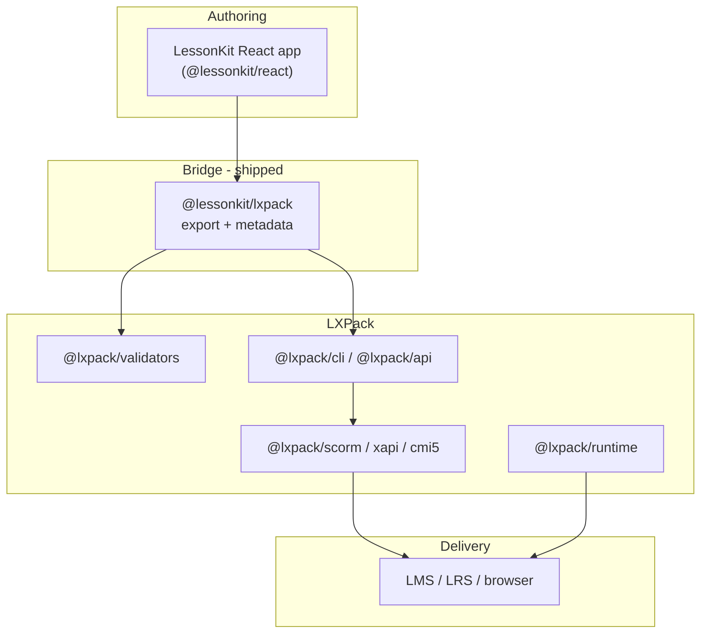

# LXPack upgrades for LessonKit interoperability

> **For LXPack maintainers:** see **[Upgrade plan for maintainers](lxpack-upgrades.md#upgrade-plan-for-lxpack-maintainers)** for the forward-looking upgrade plan (responsibility shifts, proposed APIs, release sequence). This page is the historical checklist and LessonKit-side integration status.
>
> **LessonKit [1.0.0](https://github.com/eddiethedean/lessonkit)** ships `@lessonkit/lxpack`, `@lessonkit/cli`, and the golden packaging example. **LXPack v0.4.0–v0.6.2** shipped SPA lessons, `@lxpack/api`, `packageLessonkit()`, `@lxpack/spa-bridge`, `@lxpack/conformance`, and `@lxpack/lessonkit`. See [LessonKit interoperability](lessonkit-interoperability.md) for current usage.

This document captures the improvements we wanted in [LXPack](https://github.com/eddiethedean/lxpack) so it works
better as the **packaging and LMS export layer** for
[LessonKit](https://github.com/eddiethedean/lessonkit).

LessonKit is React-first authoring (`@lessonkit/react`). LXPack is a manifest-driven compiler and
runtime (`course.yaml`, markdown/HTML/component lessons, SCORM/xAPI/cmi5 export). The two projects
are complementary: LessonKit owns the developer experience; LXPack owns validation, preview, and LMS
artifacts.

Related LessonKit docs ([github.com/eddiethedean/lessonkit](https://github.com/eddiethedean/lessonkit)):

- [Documentation](https://lessonkit.readthedocs.io/en/latest/) — guides, CLI, packaging, identity
- [`ROADMAP.md`](https://github.com/eddiethedean/lessonkit/blob/main/ROADMAP.md) — framework roadmap (1.0 shipped)
- [`SPEC.md`](https://github.com/eddiethedean/lessonkit/blob/main/SPEC.md) — technical spec
- [`PACKAGING.md`](https://github.com/eddiethedean/lessonkit/blob/main/docs/PACKAGING.md) — `@lessonkit/lxpack` workflow

---

## Current integration (LessonKit 1.0)

LessonKit’s **shipped** path:

1. Author courses in React with `@lessonkit/react` (`courseId`, `lessonId`, `checkId`).
2. Describe the course in a **`LessonkitCourseDescriptor`** or root **`lessonkit.json`** (`schemaVersion: 1`).
3. Build with Vite (`lessonkit build` → `dist/`).
4. Package with **`@lessonkit/lxpack`** (`packageLessonkitCourse`) or **`lessonkit package --target scorm12`**.

LXPack validates, runs the learner shell, and emits SCORM/xAPI/cmi5 artifacts via `@lxpack/api` **0.6.2+**.

See [LessonKit packaging](https://lessonkit.readthedocs.io/en/latest/reference/packaging.html) and [examples/lxpack-golden](https://github.com/eddiethedean/lessonkit/tree/main/examples/lxpack-golden).

---

## Historical integration plan (pre–SPA lesson type)

Before LXPack `type: spa` and `@lessonkit/lxpack`, exporting React courses required lossy translation to markdown/HTML. The goals below drove the v0.4–v0.6 interoperability work (now shipped).

## Design goals

| Goal | Why it matters |
|------|----------------|
| **Preserve React authoring** | LessonKit users should not rewrite courses as YAML/markdown to ship to an LMS. |
| **Stable identity model** | `courseId`, `lessonId`, assessment ids must map 1:1 into tracking, xAPI, and SCORM suspend data. |
| **Shared tracking semantics** | Completion, quiz pass/fail, and time-on-task should mean the same thing in both runtimes. |
| **Programmatic packaging** | `@lessonkit/lxpack` needs library APIs, not only CLI subprocesses. |
| **npm-first consumption** | LessonKit uses npm workspaces; LXPack packages should install cleanly without requiring pnpm for consumers. |

---

## Gap analysis

### 1. Authoring model mismatch

| LXPack today | LessonKit today |
|--------------|-----------------|
| Declarative `course.yaml` + file-based lessons | JSX component tree (`Course`, `Lesson`, `Quiz`, …) |
| Lesson types: `markdown`, `html`, `component` | Rich React composition, custom layout, app state |
| Built-in widgets (`callout`, `image-card`, …) | Framework primitives + user-defined UI |

**Pain:** Exporting LessonKit → LXPack today implies serializing React to markdown/HTML or
re-implementing interactions as LXPack component lessons. That breaks fidelity and accessibility
work done in React.

### 2. No first-class “hosted React bundle” lesson type

LXPack can package standalone web apps, but there is no documented lesson type for:

- A Vite/React build output as a **lesson SCO** with known entry (`index.html`)
- Wiring that lesson into `flow`, completion rules, and multi-SCO SCORM 2004

**Pain:** LessonKit’s natural artifact is a built SPA, not a folder of markdown files.

### 3. CLI-centric integration surface

LXPack’s primary interface is `@lxpack/cli` (`init`, `preview`, `validate`, `build`). LessonKit
needs:

- `validateCourse(project)` / `buildCourse(project, target)` as **importable functions**
- Typed options and structured errors (for CI and `@lessonkit/lxpack`)

**Pain:** Subprocess + stdout parsing is fragile for monorepo CI and IDE integrations.

### 4. Tracking and xAPI vocabulary alignment

LessonKit (0.1.x) emits telemetry events and minimal xAPI statements (`started`, `completed`).
LXPack has mature tracking, completion thresholds, quiz YAML, and export-time embedding.

**Pain:** Without a shared event/verb map, adapters guess at semantics and LRS reports diverge.

### 5. Assessment model differences

| LXPack | LessonKit |
|--------|-----------|
| Author YAML in `assessments/`; keys embedded at build | Inline `Quiz` / `KnowledgeCheck` in React |
| `passingScore`, `maxAttempts`, shuffle, feedback modes | Simple correct/incorrect + `useQuizState` hooks |

**Pain:** Export must invent assessment YAML from React props or lose quiz metadata.

### 6. Theming and accessibility

LessonKit targets WCAG 2.1 AA with React semantics and `@lessonkit/accessibility` helpers. LXPack
runtime uses markdown sanitization, HTML interactions, and `runtime.theme` CSS classes.

**Pain:** Branding and a11y behavior may differ between preview (LXPack) and author preview
(LessonKit/Vite) unless theme contracts align.

---

## Recommended LXPack upgrades

Prioritized from **highest leverage for LessonKit** to **nice-to-have**.

### P0 — React / SPA lesson type

**Proposal:** Add a lesson type (working name: `react` or `spa`) to `course.yaml`:

```yaml
lessons:
  - id: phishing-101
    title: Phishing Awareness
    type: spa
    path: dist/lessons/phishing-101   # folder with index.html + assets
    runtime:
      mount: root                      # optional; default #root
```

**Behavior:**

- Package the folder as a launchable unit in standalone, SCORM 1.2, SCORM 2004 (SCO), xAPI, cmi5.
- Expose a **stable parent bridge** (`window.parent.lxpack` or `postMessage`) for:
  - `completeLesson({ lessonId })`
  - `reportAssessment({ id, score, passed })`
  - optional xAPI statement passthrough

**Why:** Lets LessonKit ship `vite build` output per lesson without converting UI to markdown.

**Acceptance criteria:**

- Example course in LXPack repo: one `spa` lesson + one markdown lesson in the same package.
- SCORM 2004 multi-SCO export launches each SPA in an iframe with correct sequencing.
- Documented bridge API versioned (`lxpackBridge.v1`).

---

### P0 — Programmatic build and validate API

**Proposal:** Export stable functions from `@lxpack/cli` or a new `@lxpack/api` package:

```ts
import { validateCourse, buildCourse } from "@lxpack/api";

const result = await validateCourse({ courseDir: "/path/to/course", target: "scorm12" });
const artifact = await buildCourse({ courseDir, target: "scorm2004", output: "./out.zip" });
```

**Requirements:**

- Structured result: `{ ok, errors: [{ path, rule, message }], warnings }`
- No global process cwd assumptions; all paths explicit
- Works when imported from npm (LessonKit) without pnpm

**Why:** Enables `@lessonkit/lxpack` to run in CI and tests without shelling out.

---

### P1 — Import / interchange schema (`lessonkit.json` or `lxpack.import`)

**Proposal:** Support an optional interchange file at course root:

```json
{
  "format": "lessonkit",
  "version": "1",
  "course": { "id": "cyber-basics", "title": "Cybersecurity Basics" },
  "lessons": [
    {
      "id": "phishing-101",
      "title": "Phishing Awareness",
      "type": "spa",
      "build": { "command": "npm run build", "outputDir": "dist" }
    }
  ],
  "assessments": [],
  "tracking": { "completion": { "threshold": 0.9 } }
}
```

**Behavior:**

- `lxpack validate` merges interchange + generated `course.yaml` (or generates yaml at build time).
- Validators understand LessonKit ids and required fields.

**Why:** Reduces duplication between LessonKit metadata and hand-maintained `course.yaml`.

---

### P1 — Shared tracking event catalog

**Proposal:** Document and export a shared enum / JSON schema for learning events:

| Event | xAPI verb (suggested) | SCORM mapping |
|-------|----------------------|---------------|
| `lesson_started` | `initialized` / custom | `cmi.core.lesson_status` |
| `lesson_completed` | `completed` | completion |
| `quiz_answered` | `answered` | interaction |
| `quiz_completed` | `completed` | score |
| `course_completed` | `completed` | course complete |

Publish as `@lxpack/tracking-schema` (or extend `@lessonkit/core` with LXPack-compatible exports).

**Why:** LessonKit and LXPack runtimes report the same analytics to LRS and internal sinks.

---

### P1 — Assessment interchange from structured data

**Proposal:** Allow assessments to be defined in JSON/YAML **or** supplied at build time:

```ts
buildCourse({
  courseDir,
  target: "scorm12",
  assessments: [{ id: "final_quiz", questions: [...] }], // validated by @lxpack/validators
});
```

**Why:** `@lessonkit/lxpack` can extract `Quiz` props / config from React without writing
`assessments/*.yaml` to disk.

---

### P2 — Plugin slot for custom lesson runtimes

**Proposal:** Formal plugin API in `@lxpack/cli` / `@lxpack/runtime`:

```ts
registerLessonRuntime("lessonkit-react", {
  validate(lesson, ctx) { ... },
  bundle(lesson, ctx) { ... },
  preview(lesson, ctx) { ... },
});
```

**Why:** LessonKit can register a runtime once instead of forking LXPack lesson types.

---

### P2 — Theme token bridge

**Proposal:** Accept external design tokens (CSS variables) from a `theme/tokens.json` or
`@lessonkit/themes` export:

```yaml
runtime:
  theme: lessonkit-default
  cssVariables:
  --lk-color-primary: "#2563eb"
```

**Why:** Visual parity between LessonKit dev preview and LXPack-packaged learner view.

---

### P3 — Documentation and examples (shipped)

Delivered in LXPack v0.6.x:

- **Guide:** [LessonKit interoperability](lessonkit-interoperability.md)
- **Example:** [`examples/lessonkit-spa/`](https://github.com/eddiethedean/lxpack/tree/main/examples/lessonkit-spa) and [LessonKit lxpack-golden](https://github.com/eddiethedean/lessonkit/tree/main/examples/lxpack-golden)
- **Package map:** [LessonKit and LXPack packages](lessonkit-packages.md)

## Suggested division of responsibility



| Layer | Owner | Responsibility |
|-------|--------|----------------|
| Authoring UX | LessonKit | Components, hooks, a11y, Vite templates |
| Export adapter | `@lessonkit/lxpack` | Build SPA(s), emit interchange + invoke LXPack |
| Validation & packaging | LXPack | Schema, path containment, SCORM/xAPI/cmi5 ZIPs |
| Learner runtime | LXPack (+ SPA bridge) | Navigation, flow, LMS APIs, quiz engine where applicable |

---

## Phased rollout (cross-repo)

| Phase | LXPack | LessonKit |
|-------|--------|-----------|
| **1** | Document SPA lesson type + bridge API (even if experimental) | Spike `@lessonkit/lxpack` export to static `dist/` |
| **2** | Ship `@lxpack/api` validate/build | Wire `lessonkit package` → `lxpack build` |
| **3** | Tracking schema + assessment build injection | Align `@lessonkit/xapi` verbs with schema |
| **4** | Plugin runtime registration | Optional: embed `@lxpack/runtime` navigation shell around SPA |

---

## Non-goals (for now)

- Merging the two repos into one monorepo
- Replacing LXPack markdown authoring with LessonKit-only workflows
- Requiring LessonKit authors to learn full `course.yaml` before they can ship

---

## Open questions for LXPack maintainers

1. **Single-SCO vs multi-SCO:** Should a LessonKit `Course` map to one SCORM package or one SCO per `Lesson`?
2. **Answer keys in SPA lessons:** Should quiz scoring stay in LXPack runtime only, or allow client-side scoring inside the SPA with signed/embedded config?
3. **Versioning:** How should `lxpackBridge.v1` evolve without breaking published LessonKit courses?
4. **npm vs pnpm:** Can release CI guarantee `@lxpack/*` packages work as npm dependencies in LessonKit’s workspace?

---

## Summary

LXPack already solves problems LessonKit should not rebuild (SCORM manifests, ZIP packaging, xAPI/cmi5,
validation, preview). The highest-value upgrades for LessonKit interoperability are:

1. **SPA/React lesson type** with a stable LMS bridge API  
2. **Programmatic validate/build APIs** for tooling and CI  
3. **Shared tracking and assessment interchange** so React authoring maps cleanly to exports  

Implementing P0 items unblocks `@lessonkit/lxpack` and delivers LMS-ready packages without forcing
authors out of React.
