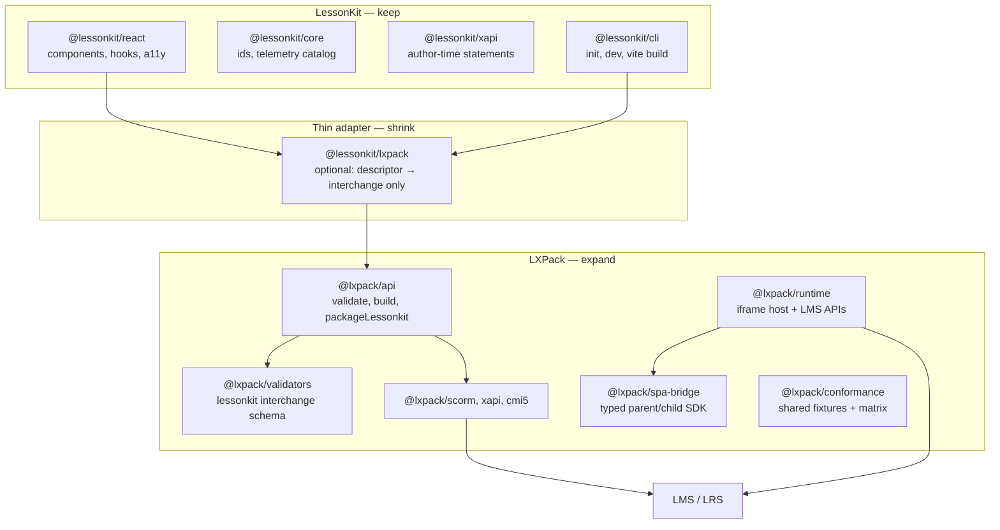

# LXPack upgrade plan for LessonKit interoperability

**Audience:** [LXPack](https://github.com/eddiethedean/lxpack) maintainers and contributors.  
**Purpose:** Prioritize LXPack changes that reduce duplication, tighten the LessonKit integration contract, and move packaging/runtime concerns to the right layer.  
**Roadmap:** **v0.5.0** = [Phase 0.5](developer/ROADMAP.md#phase-05--lessonkit-integration-depth-planned--v050) (thin packaging + interchange schema). **v0.6+** = remaining LessonKit integration, AI tooling, ecosystem — [ROADMAP.md](developer/ROADMAP.md#v06-lessonkit-integration-and-platform).  
**LessonKit reference:** [`@lessonkit/lxpack`](https://github.com/eddiethedean/lessonkit/tree/main/packages/lxpack) (adapter, v0.8.0) · [golden example](https://github.com/eddiethedean/lessonkit/tree/main/examples/lxpack-golden) · [packaging guide](PACKAGING.md)

---

## Executive summary

LessonKit authors **React** courses; LXPack **validates, packages, and runs** them in LMS contexts. **v0.4.0** delivered the critical baseline (SPA lessons, `@lxpack/api`, `lessonkit.json` merge, in-memory assessments, `lxpackBridge.v1`).

The next wins are not “more lesson types”—they are **shrinking `@lessonkit/lxpack`** so LXPack owns interchange, project materialization, bridge contracts, and conformance. LessonKit should keep React authoring, telemetry catalog, and thin CLI wiring.

**Target end state:** `@lessonkit/lxpack` becomes a small facade (or is retired in favor of `@lxpack/api` + `@lxpack/lessonkit`).

---

## Current integration (baseline)

### What LessonKit does today (`@lessonkit/lxpack`)

| Step | Owner today | Notes |
|------|-------------|--------|
| Validate `LessonkitCourseDescriptor` | LessonKit | Uses `@lessonkit/core` id rules + layout rules |
| Copy Vite `dist/` into LXPack tree | LessonKit | `single-spa` → `{outDir}/dist`; `per-lesson-spa` → per-lesson paths |
| Emit `course.yaml` | LessonKit | Custom minimal YAML emitter (`packages/lxpack/src/yaml.ts`) |
| Emit `assessments/*.yaml` | LessonKit | From descriptor; also passes structured assessments to `buildCourse` |
| Emit `lessonkit.json` interchange | LessonKit | `format: "lessonkit"`, `version: "1"` |
| Map theme → `runtime.cssVariables` | LessonKit | Depends on `@lessonkit/themes` |
| `validateCourse` / `buildCourse` | LXPack (`@lxpack/api`) | After files are on disk |
| Staging + atomic promote to `outDir` | LessonKit | Temp dir; rollback on failure |
| Runtime bridge (browser) | Split | LXPack exposes `lxpackBridge.v1`; LessonKit normalizes scores + forwards telemetry |

### What LXPack already owns (keep)

- SCORM 1.2 / 2004 / standalone / xAPI / cmi5 packaging
- `course.yaml` schema + path containment
- Learner shell, flow, native quiz engine, LMS APIs
- SPA iframe + parent bridge host
- `@lxpack/tracking-schema` (native LXPack courses)

### Pain points driving this plan

1. **Duplicate manifest authoring** — LessonKit re-implements YAML generation and assessment shaping that LXPack validators already understand.
2. **Two sources of truth for assessments** — On-disk YAML *and* `buildCourse({ assessments })`; easy to drift.
3. **Bridge contract is implicit** — Score scale (0–1 vs points), method names, and versioning are documented in LessonKit, not as a typed LXPack package.
4. **No first-class “package from interchange” API** — Adapter must write a full LXPack project tree before every build.
5. **Tracking vocabularies diverge** — LessonKit `telemetry` events vs LXPack `track()` / xAPI export paths are aligned by convention, not schema.
6. **Preview gap** — Authors use Vite for dev; LXPack preview requires a materialized project; parity testing is manual.
7. **Conformance is one-sided** — LessonKit 0.9.x plans Playwright parity tests; LXPack has no shared fixture contract.

---

## Recommended division of responsibility



| Concern | Should live in | Rationale |
|---------|----------------|-----------|
| React components, block catalog, WCAG helpers | LessonKit | Authoring UX and Studio (future) |
| `courseId` / `lessonId` / `checkId` validation rules | LessonKit (`@lessonkit/core`) | Framework identity; LXPack should *accept* ids, not define pedagogy |
| Interchange schema (`lessonkit.json` v1+) | **LXPack validators** | Single schema for any React toolchain, not only LessonKit |
| Materialize SPA + `course.yaml` from interchange | **LXPack API** | Removes YAML emitters from LessonKit |
| Assessment normalization (MCQ shape, passingScore semantics) | **LXPack validators** | One canonical assessment model at build time |
| SCORM/xAPI/cmi5 ZIP creation | LXPack | Already core competency |
| `lxpackBridge` contract + client SDK | **LXPack (`@lxpack/spa-bridge`)** | SPA authors (LessonKit or not) import one package |
| Map LessonKit telemetry → bridge / `track()` | LessonKit (`@lessonkit/react`) | Framework knows event names; calls LXPack SDK |
| Theme token → `runtime.cssVariables` | **LXPack** (generic) + LessonKit preset map (thin) | LXPack should not depend on `@lessonkit/themes` |
| End-to-end conformance fixtures | **Shared repo or `@lxpack/conformance`** | Both CI pipelines run the same matrix |
| `lessonkit package` CLI | LessonKit | UX wrapper calling LXPack API |

---

## Proposed LXPack upgrades (prioritized)

### P0 — Package LessonKit without a hand-built project tree

**Problem:** `@lessonkit/lxpack` writes `course.yaml`, assessment YAML, copies `dist/`, writes `lessonkit.json`, then calls `buildCourse`. LessonKit maintains parallel YAML emitters.

**Proposal:** Add to `@lxpack/api`:

```ts
import type { ExportTarget } from "@lxpack/api";

export type PackageLessonkitOptions = {
  /** Merged interchange + course metadata (see schema below). */
  interchange: LessonkitInterchangeV1;
  /** SPA payloads: lesson id → absolute path to folder with index.html */
  spaDirs: Record<string, string>;
  /** Optional in-memory assessments (same shape as buildCourse today). */
  assessments?: AssessmentInput[];
  target: ExportTarget;
  /** Output zip or directory; optional staging courseDir for debugging */
  output?: string;
  dir?: boolean;
  courseDir?: string; // default: temp; kept on failure if debug: true
};

export type PackageLessonkitResult =
  | { ok: true; outputPath?: string; outputDir?: string; fileCount: number; courseDir: string }
  | { ok: false; issues: Array<{ path?: string; message: string; severity?: "error" | "warning" }> };

export function packageLessonkit(options: PackageLessonkitOptions): Promise<PackageLessonkitResult>;
```

**LXPack responsibilities:**

- Generate `course.yaml` internally from interchange (no consumer YAML emitter).
- Copy SPA dirs with path containment (reuse existing rules).
- Prefer **only** in-memory `assessments` for LessonKit-sourced quizzes; skip writing `assessments/*.yaml` unless `writeAuthoringFiles: true`.
- Return structured issues (same shape as `validateCourse`).

**Acceptance criteria:**

- `examples/lessonkit-spa` builds using *only* `@lxpack/api` (no checked-in `course.yaml` required for LessonKit path).
- LessonKit deletes `yaml.ts`, `assessmentYaml.ts`, and most of `writeProject.ts`.
- CI: golden LessonKit course packages identically before/after migration (ZIP hash or manifest comparison).

**LessonKit follow-up:** `packageLessonkitCourse()` becomes a thin wrapper mapping `LessonkitCourseDescriptor` → `PackageLessonkitOptions`.

---

### P0 — Formalize `lxpackBridge` as `@lxpack/spa-bridge`

**Problem:** Bridge types and score normalization live in `@lessonkit/lxpack/bridge`. Non-LessonKit SPAs duplicate logic; versioning is informal.

**Proposal:** New package (or `@lxpack/runtime/bridge` export):

```ts
// Host (LXPack runtime) — register once
export function createLxpackBridgeHost(options: BridgeHostOptions): LxpackBridgeV1;

// Child (SPA) — safe access from iframe
export function getLxpackBridge(): LxpackBridgeV1 | null;
export function normalizeScore(raw: { score: number; maxScore?: number }): number | null;
export function normalizePassingThreshold(raw: { passingScore?: number; maxScore?: number }): number;

export type LxpackBridgeV1 = {
  completeLesson(lessonId: string): void;
  completeCourse(): void;
  submitAssessment(payload: { id: string; score: number; passingScore?: number }): void;
  track?(event: TrackingSchemaEvent): void;
};
```

**Document in LXPack docs:**

| Method | Score / threshold scale | When to call |
|--------|-------------------------|--------------|
| `submitAssessment` | **0–1** scaled | After quiz graded in SPA |
| YAML `passingScore` in author assessments | **absolute points** | Native LXPack quizzes only |

**Versioning:** Keep `window.parent.lxpackBridge.v1`; add `v2` alongside with a capability negotiation helper (`bridge.supportedVersions`).

**Acceptance criteria:**

- Published TypeScript types on npm.
- `examples/lessonkit-spa` imports child SDK from `@lxpack/spa-bridge`.
- LessonKit removes duplicate `bridge.ts` and depends on LXPack package.
- Validator warns when SPA `index.html` references deprecated `window.parent.lxpack` without bridge.

---

### P1 — Own the `lessonkit.json` interchange schema

**Problem:** Schema is implied by LessonKit’s `LessonkitInterchangeV1` type; LXPack merges file at build time but does not publish a versioned JSON Schema / Zod module.

**Proposal:**

- Add `@lxpack/validators/lessonkit` (or `lessonkitInterchangeSchema` export).
- Document fields:

```json
{
  "format": "lessonkit",
  "version": "1",
  "course": { "id": "course-id", "title": "Title" },
  "lessons": [{ "id": "lesson-id", "title": "...", "type": "spa", "path": "dist" }],
  "assessments": [{ "id": "check-id", "passingScore": 1, "questions": [] }],
  "tracking": { "completion": { "threshold": 1 } },
  "runtime": { "theme": "default", "cssVariables": { "--lk-color-primary": "#2563eb" } }
}
```

- `validateCourse` accepts interchange-only projects (generates missing `course.yaml`).
- Breaking changes bump `version: "2"` with migration notes.

**Shift from LessonKit:** Stop emitting interchange by hand in `descriptorToInterchange`; optionally generate from descriptor in LessonKit until descriptors are deprecated.

**Acceptance criteria:**

- JSON Schema published under `docs/reference/lessonkit-interchange.md`.
- Invalid interchange fails `validateCourse` with path-qualified errors.
- LessonKit CI imports schema from `@lxpack/validators` (devDependency) instead of duplicating rules.

---

### P1 — Unified tracking map (LessonKit telemetry ↔ LXPack)

**Problem:** LessonKit emits `lesson_completed`, `quiz_completed`, etc. (`@lessonkit/core` catalog). LXPack has `@lxpack/tracking-schema`. Adapters guess mappings for bridge and xAPI.

**Proposal:**

- Publish `mapLessonkitTelemetryToLxpack(event): TrackingSchemaEvent | null` in `@lxpack/tracking-schema` (or `@lxpack/api`).
- Publish verb / activity IRI recommendations for packaged courses (xAPI export).
- Optional: `bridge.track()` accepts canonical events so SPAs can forward rich telemetry without custom LMS code.

**Reference mapping (starter):**

| LessonKit `TelemetryEventName` | LXPack / xAPI intent |
|-------------------------------|----------------------|
| `course_started` | course initialized |
| `course_completed` | course completed |
| `lesson_started` | lesson initialized |
| `lesson_completed` | `completeLesson` + completed verb |
| `quiz_answered` | interaction / answered |
| `quiz_completed` | `submitAssessment` + scored |
| `interaction` | `track({ type, id, data })` |

**Acceptance criteria:**

- Table is documented and unit-tested in LXPack.
- LessonKit `@lessonkit/react` uses exported mapper (delete bespoke switch in `lxpackBridge.ts`).
- xAPI ZIPs from LessonKit courses use consistent activity ids derived from interchange `course.id` / lesson ids.

---

### P1 — Theme interchange without `@lessonkit/themes`

**Problem:** `themeToLxpackRuntime()` in LessonKit depends on `@lessonkit/themes` to produce `runtime.cssVariables`.

**Proposal:**

- Interchange carries optional `runtime.cssVariables` (already natural in YAML).
- LXPack applies variables to learner shell (already supports `runtime.cssVariables` in `course.yaml`).
- Optional: `runtime.themePreset: "lessonkit:brand"` resolved via a **registered preset table** in LXPack or passed fully expanded in interchange.

**Shift:** LessonKit only expands presets at package time (one function), or authors commit expanded variables in `lessonkit.json`. LXPack does not import LessonKit packages.

---

### P2 — Preview and validate from SPA build output

**Problem:** Developers run `lessonkit dev` (Vite) but must materialize `.lxpack/course` to use `lxpack preview` with LMS chrome.

**Proposal:**

```bash
lxpack preview --lessonkit ./lessonkit.json --spa dist/
```

- Starts runtime with SPA lesson iframe + bridge host.
- Optional SCORM simulator flags (existing `lxpack.config.json` preview modes).

**Acceptance criteria:**

- Documented workflow in [LessonKit interoperability](https://lxpack.readthedocs.io/en/latest/guides/lessonkit-interoperability/) guide.
- No `assessments/*.yaml` required on disk when passing `--assessments` JSON path or embedded in interchange.

---

### P2 — SCORM layout recipes for LessonKit

**Problem:** LessonKit supports `single-spa` (one SCO, in-app navigation) vs `per-lesson-spa` (multi-SCO). Authors lack LXPack guidance on SCORM 2004 sequencing for each.

**Proposal:**

- Document **recipes** in LXPack:
  - **Recipe A — Single SCO SPA** (default LessonKit): one `type: spa` lesson; completion via bridge.
  - **Recipe B — Multi SCO**: one SPA folder per `lessonId`; flow optional; map `lesson_completed` per SCO.
- Validators emit **warnings** when interchange lessons omit `path` or id collisions would break SCORM 2004.
- SCORM SPA layout is determined by `build`/`packageLessonkit` `target` (SCORM 1.2 = single SCO; SCORM 2004 = multi-SCO) and lesson count; use `inferScormSpaLayout()` from `@lxpack/validators` for docs/warnings only.

**Open question for maintainers:** Should multi-lesson React apps *ever* share one SPA build (hash router), or should LXPack enforce per-lesson builds for true multi-SCO?

---

### P2 — Shared conformance harness (`@lxpack/conformance` or `test/fixtures/lessonkit`)

**Problem:** LessonKit 0.9.x plans export parity tests; LXPack risks regressions without shared fixtures.

**Proposal:**

- Git submodule or npm package with:
  - Minimal interchange + tiny SPA fixture (static HTML + one quiz call to bridge).
  - Matrix: `standalone`, `scorm12`, `scorm2004`, `xapi`, `cmi5`.
  - Expected: launch succeeds, `completeLesson` marks complete, `submitAssessment` records score.
- Both repos run `npx @lxpack/conformance` in CI.

**Acceptance criteria:**

- LXPack release workflow runs conformance on tag.
- LessonKit packaging smoke imports same package (no forked fixture copies).

---

### P3 — Optional `@lxpack/lessonkit` meta-package

**Problem:** Consumers install `@lessonkit/lxpack` + `@lxpack/api` and must understand Node 20+, interchange, bridge.

**Proposal:**

- `@lxpack/lessonkit` re-exports `packageLessonkit`, bridge SDK, schema types.
- Peer dependency: `react` not required (packaging only).
- LessonKit deprecates `@lessonkit/lxpack` over a major version with migration guide.

---

## What should stay in LessonKit (non-goals for LXPack)

- React component library and hooks (`Course`, `Lesson`, `Quiz`, …).
- Authoring-time telemetry sinks and `@lessonkit/xapi` client (distinct from LMS-export xAPI inside LXPack).
- Vite template, `lessonkit init`, `lessonkit dev`, `lessonkit build`.
- Block catalog for AI/Studio (`block-catalog.v1.json`).
- WCAG primitives (`@lessonkit/accessibility`).

**Non-goals (both projects):**

- Merging repositories.
- Replacing LXPack markdown/HTML authoring with LessonKit-only workflows.
- Re-implementing SCORM manifest generation in LessonKit.

---

## Suggested LXPack release sequence

Aligned with [ROADMAP.md](developer/ROADMAP.md): **v0.5.0** ships thin packaging; **v0.6+** ships the rest.

| Release | Theme | Key deliverables |
|---------|--------|------------------|
| **v0.5.0** | Thin packaging | `packageLessonkit()`, interchange Zod schema, docs update |
| **v0.6+** | Bridge SDK | `@lxpack/spa-bridge`, versioning doc, validator warnings |
| **v0.6+** | Tracking + theme | Telemetry map, expanded interchange `runtime`, preview flags, SCORM recipes |
| **v0.6+** | Conformance | Shared fixtures package, export-target matrix |
| **v0.6+** | Meta-package | `@lxpack/lessonkit`; deprecate duplicate adapter surface |

Coordinate with LessonKit **0.9.x** (conformance harness) and **1.0.0** (stable public API).

---

## API stability commitments (request to LXPack)

LessonKit **1.0.0** needs these to remain stable (or versioned with migration):

1. `lxpackBridge.v1` method signatures and **0–1** score semantics for `submitAssessment`.
2. `lessonkit.json` `format` + `version` with documented migration path.
3. `ExportTarget` enum and `buildCourse` / `packageLessonkit` result shapes.
4. SPA lesson `type: spa` + `path` pointing at folder with `index.html`.

---

## How to validate with LessonKit today

Maintainers can verify changes against the LessonKit repo without adopting the full monorepo:

```bash
git clone https://github.com/eddiethedean/lessonkit.git
cd lessonkit
npm ci
npm run build
npm -w lessonkit-example-lxpack-golden run build
npm -w lessonkit-example-lxpack-golden run package:scorm12
```

Artifacts: `examples/lxpack-golden/.lxpack/course/.lxpack/out/course-scorm12.zip`

**Contact surface:** open issues in either repo with label `interop/lessonkit`; attach interchange JSON and `buildCourse` / `packageLessonkit` structured errors.

---

## Summary for LXPack maintainers

1. **Absorb project materialization** — `packageLessonkit()` so adapters stop writing YAML by hand.  
2. **Own interchange + bridge** — schema, typed SDK, explicit score semantics.  
3. **Publish tracking maps** — one table from LessonKit telemetry to LXPack/LRS.  
4. **Ship shared conformance** — both projects gate releases on the same fixture matrix.  
5. **Keep LessonKit thin** — React authoring only; LMS delivery stays in LXPack.

---

## Related documents

| Document | Audience |
|----------|----------|
| [Product ROADMAP — Phase 0.5 / v0.6+](developer/ROADMAP.md#phase-05--lessonkit-integration-depth-planned--v050) | v0.5.0 scope vs v0.6+ deferred work |
| [LessonKit packaging guide](PACKAGING.md) | LessonKit authors |
| [Historical upgrade checklist (LessonKit)](LXPACK_UPGRADES_FOR_LESSONKIT.md) | What v0.4.0 already shipped |
| [LXPack LessonKit interoperability](https://lxpack.readthedocs.io/en/latest/guides/lessonkit-interoperability/) | LXPack docs (maintain alongside this plan) |
| [LessonKit ROADMAP](../ROADMAP.md) | 0.9.x conformance, 1.0.0 gate |
