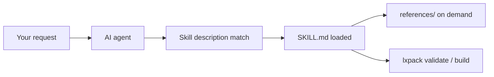

# Library Skills

**Library Skills** are portable instruction packages for AI coding agents (Claude Code, Cursor, Windsurf, Aider, and others). Each skill is a folder with a `SKILL.md` file — the open [Agent Skills](https://agentskills.io) format — plus optional `references/` and `scripts/`.

## Why Library Skills exist

Large language models are trained on stale data. They will guess wrong about:

- Which `lxpack` CLI flags exist in **v0.6.2**
- How `course.yaml` must reference lessons and quizzes
- What HTML interactions need for SCORM completion tracking

Library Skills are **lazy-loaded expertise**: the agent sees a short `description` in YAML frontmatter, loads the full skill only when your task matches, and reads `references/` files only when the skill instructs it to — not a giant prompt on every message.



## LXPack skills included

| Skill | Triggers when you… |
|-------|---------------------|
| **lxpack-author** | Edit `course.yaml`, lessons, quizzes, branching |
| **lxpack-interaction** | Build or fix HTML labs in `interactions/` |
| **lxpack-export** | Package for SCORM, xAPI, or cmi5 |
| **lxpack-migrate-legacy** | Move content from Storyline, Rise, Captivate, or multi-page HTML courses |

Source lives in the repository: [`library-skills/`](https://github.com/eddiethedean/lxpack/tree/main/library-skills).

## Install

--8<-- "copy-tip.md"

From a clone of LXPack (or your fork):

--8<-- "commands/library-skills-install.md"

```bash title="Install skills for LXPack repo contributors only"
./library-skills/install.sh --project
```

The installer copies skills to:

| Scope | Locations |
|-------|-----------|
| Global | `~/.cursor/skills/`, `~/.claude/skills/`, `~/.agents/skills/` |
| Project | `<course>/.cursor/skills/`, `<course>/.claude/skills/` |

Re-run after `git pull` to refresh.

!!! tip "Cursor users"
    Ensure **Skills** are enabled in Cursor settings. Open the course folder (where `course.yaml` lives), not a single file.

!!! tip "Claude Code users"
    Skills in `~/.claude/skills/` or project `.claude/skills/` are picked up automatically when descriptions match your task.

## Skill layout

```text title="lxpack-author/"
lxpack-author/
  SKILL.md           # Frontmatter + core instructions
  references/        # manifest.md, assessments.md, branching.md
  scripts/
    validate.sh      # Finds course.yaml and runs lxpack validate
    preview.sh       # Runs lxpack preview
```

Scripts require `@lxpack/cli` on your PATH (`npm install -g @lxpack/cli`).

## Library Skills vs copy-paste prompts

| Approach | Best for |
|----------|----------|
| [Prompts for Claude & Cursor](prompts-for-claude.md) | One-off tasks in chat; copy button per prompt |
| **Library Skills** | Ongoing work in an IDE agent; automatic trigger by description |

Use both: install Library Skills for day-to-day authoring; keep prompt snippets for stakeholder-specific wording.

## Requirements

- Node.js 18 or 20
- `@lxpack/cli` globally or `pnpm exec lxpack` when hacking LXPack from source
- Agent product that supports `SKILL.md` discovery

## Related workflows

- [Workflow with Claude Code](workflow-claude-code.md)
- [Workflow with Cursor (without Claude)](workflow-cursor.md)
- [Workflow overview](workflow-overview.md)
