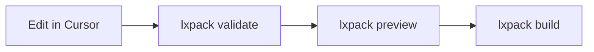

# Workflow with Cursor (without Claude)

--8<-- "copy-tip.md"

Use **Cursor as your editor** for LXPack courses when you want a modern IDE — file tree, syntax highlighting, integrated Terminal — but you **do not use Claude** (no Claude subscription, no Agent/Chat, or your organization disables AI in the editor).

You author content yourself (or paste from Word, Storyline exports, SME documents). The **lxpack** commands are the same as every other workflow.

!!! note "Not the same as Claude Code"
    [Workflow with Claude Code](workflow-claude-code.md) is for teams that use **Cursor + Claude** to edit files. This guide is for **Cursor only** — you are the author; Cursor is your text editor.

## Who this track fits

| You… | This track works well |
|------|------------------------|
| Prefer an IDE over Notepad/TextEdit | Yes |
| Write your own Markdown and YAML | Yes |
| Use SME copy-paste or legacy tool exports | Yes |
| Want AI to draft lessons | Use [Claude Design](workflow-claude-design.md) or [Claude Code](workflow-claude-code.md) instead |
| Never want to open Terminal | Use a simple editor + external Terminal; Cursor is optional |

## What you need

- [Node.js and `@lxpack/cli`](../getting-started/install-cli.md)
- [Cursor](https://cursor.com/) installed (free or paid — AI features can stay off)
- Basic comfort opening a folder and saving text files

You do **not** need a Claude account or to enable Cursor’s AI features.

## One-time Cursor setup

### 1. Install Cursor

Download from [cursor.com](https://cursor.com/) and install like any desktop app.

### 2. Turn off AI (optional)

If your policy requires no AI in the editor:

- Avoid **Chat**, **Composer**, and **Agent** panels.
- In **Settings**, you can disable or ignore AI-related features; authoring still works with the file editor and Terminal only.

You are using Cursor the same way many people use VS Code: **files + Terminal**.

### 3. Helpful extensions (optional)

Search **Extensions** in Cursor (`Cmd+Shift+X` / `Ctrl+Shift+X`):

| Extension | Why |
|-----------|-----|
| **YAML** (Red Hat) | Highlights and errors in `course.yaml` and `assessments/*.yaml` |
| **Markdown All in One** | Preview and shortcuts for `lessons/*.md` |
| **HTML CSS Support** | Easier editing of `interactions/*/index.html` |

Extensions are optional; LXPack does not require them.

## Open your course

```bash title="lxpack init onboarding-2026"
lxpack init onboarding-2026
cd onboarding-2026
cursor .
```

**`cursor .`** opens the **current folder** as the workspace. You should see:

```text title="onboarding-2026/"
onboarding-2026/
  course.yaml
  lxpack.config.json
  lessons/
  interactions/
  assessments/
  assets/
```

!!! tip "Open the course root"
    Open the folder that contains `course.yaml`, not a single file. The file tree keeps manifest, lessons, and quizzes together.

## Daily authoring loop

Same pipeline as [Workflow overview](workflow-overview.md):



### 1. Edit content

| Task | Where in Cursor |
|------|-----------------|
| Reorder or add lessons | `course.yaml` — edit `lessons:` list |
| Lesson text | `lessons/*.md` |
| Quiz questions | `assessments/*.yaml` |
| Clickable lab | `interactions/<name>/index.html` |
| Images | `assets/` then reference in Markdown or HTML |

Use **File → Save** (`Cmd+S` / `Ctrl+S`) after each change.

Reference guides:

- [Writing lessons](writing-lessons.md)
- [Quizzes and assessments](quizzes-and-assessments.md)
- [Building interactions](building-interactions.md)
- [course.yaml](../reference/course-yaml.md)

### 2. Run lxpack in the integrated Terminal

Open Terminal in Cursor: **View → Terminal** or `` Ctrl+` `` (backtick).

From the course folder:

```bash title="lxpack validate"
lxpack validate
```

Fix any errors shown in red (often a wrong path in `course.yaml`). Click the file path in Terminal if Cursor links to it.

Then:

```bash title="lxpack preview"
lxpack preview
```

Open the URL in your browser. Leave Terminal running while reviewing; press `Ctrl+C` when done.

### 3. Build for the LMS

```bash title="lxpack build --target scorm12"
lxpack build --target scorm12
```

Find the ZIP under `.lxpack/`. See [Export to LMS](export-to-lms.md).

## Cursor features that help (no AI)

| Feature | How to use it for LXPack |
|---------|---------------------------|
| **Search across files** (`Cmd+Shift+F`) | Find lesson `id`s, quiz `id`s, or broken paths |
| **Split editor** | `course.yaml` on one side, `lessons/intro.md` on the other |
| **Markdown preview** | Right-click a `.md` file → Open Preview (with Markdown extension) |
| **Problems panel** | YAML extension shows schema-like mistakes before `validate` |
| **Source Control** | Optional Git: commit after each module passes `validate` |

## Suggested folder habits

Add a `.gitignore` in the course project if you use Git:

```gitignore
.lxpack/
.DS_Store
```

Do not commit build ZIPs; rebuild with `lxpack build`.

## Copying content from SMEs or legacy tools

1. Paste plain text into `lessons/*.md` (convert headings to `#` / `##`).
2. Rebuild quizzes manually in `assessments/*.yaml` — see [Quizzes and assessments](quizzes-and-assessments.md).
3. Rebuild interactions as HTML — start from the template in [Building interactions](building-interactions.md).
4. Register every new file in `course.yaml`.
5. `lxpack validate` after each batch of changes.

For a full legacy migration plan, see [Migrating from legacy tools](migrating-from-legacy-tools.md).

## Library Skills (no Claude required)

Install portable **Library Skills** so Cursor’s agent picks up LXPack rules automatically when you edit course files:

```bash title="# From LXPack repository clone"
# From LXPack repository clone
./library-skills/install.sh --global
# Or only for one course:
./library-skills/install.sh --project --directory /path/to/my-course
```

See **[Library Skills](library-skills.md)**. Skills work with Cursor’s skill discovery; you do not need Claude for the install itself.

## Prompts for Cursor Chat

Even without Claude Agent, you can paste prompts from **[Prompts for Claude & Cursor](prompts-for-claude.md)** into Cursor Chat. Use `@course.yaml` and `@lessons/` to attach context. Each prompt block has a **copy button** on the docs site.

Recommended starting points:

- **Session starter** — paste once per new chat
- **Cursor: fix validate errors** — after `lxpack validate` fails
- **Cursor: build one module** — when adding a whole section

## Compare the three IDE-related tracks

| Track | Editor | AI |
|-------|--------|-----|
| [Claude Design](workflow-claude-design.md) | Any simple editor | Claude Design / chat drafts content |
| **Cursor (this guide)** | Cursor | None — you write files |
| [Claude Code](workflow-claude-code.md) | Cursor | Claude edits files in the repo |

All three end with: **`lxpack validate` → `lxpack preview` → `lxpack build`**.

## Troubleshooting in Cursor

| Issue | What to try |
|-------|-------------|
| Terminal says `lxpack: command not found` | [Install CLI](../getting-started/install-cli.md); open a new Terminal tab |
| Wrong folder in Terminal | **Terminal → New Terminal**; `cd` to the folder with `course.yaml` |
| YAML won’t save | Check you did not open the file as read-only; save with `.yaml` extension |
| Preview shows old content | Save files; restart `lxpack preview` |

More errors: [Troubleshooting](../reference/troubleshooting.md).

## Next steps

- [Your first course](../getting-started/your-first-course.md) if you have not run `init` yet  
- [Preview and review](preview-and-review.md) for stakeholder sign-off  
- [Branching and paths](branching-and-paths.md) when you need non-linear courses
