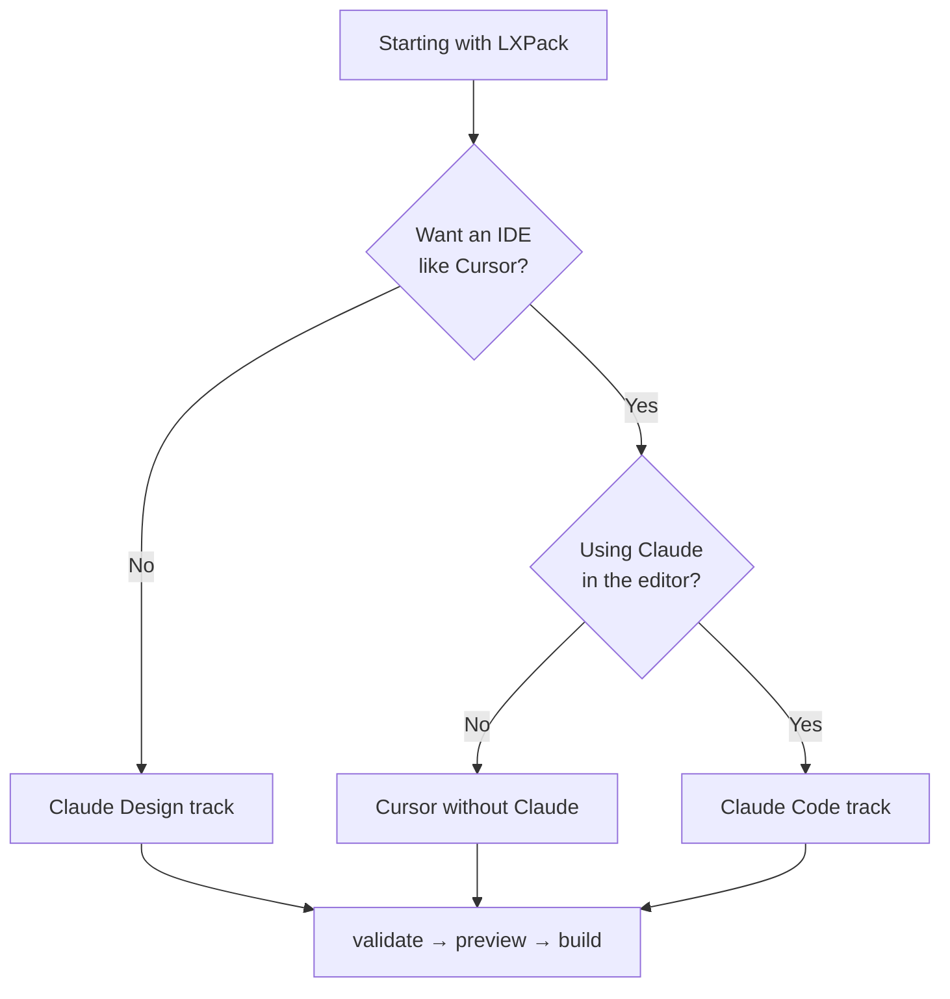

# Workflow overview

LXPack fits several authoring setups. All of them use the **same** commands to preview, validate, and build.

## Which track is for you?

| Track | Best for | Primary tools |
|-------|----------|---------------|
| **[Claude Design](workflow-claude-design.md)** | Instructional designers, LXDs, corporate trainers | Claude Design or Claude chat, any text editor, Terminal |
| **[Cursor without Claude](workflow-cursor.md)** | Authors who want an IDE but write content themselves (no AI) | Cursor, integrated Terminal, optional YAML/Markdown extensions |
| **[Claude Code](workflow-claude-code.md)** | Developers and technical IDs using AI in the IDE | Cursor + Claude Code, optional Git, Terminal |

## Shared pipeline (all tracks)

Every module you author follows this loop:

1. **Plan** — outcomes, audience, storyboard (documents, Claude, or SME input).
2. **Edit files** — `course.yaml`, `lessons/`, `assessments/`, optional `interactions/`.
3. **`lxpack validate`** — fix errors before preview.
4. **`lxpack preview`** — stakeholder review in the browser.
5. **`lxpack build --target …`** — SCORM / xAPI / cmi5 ZIP for the LMS.
6. **Upload** — LMS admin imports the ZIP from `.lxpack/`.

## Coming from Storyline or Rise?

Read [Migrating from legacy tools](migrating-from-legacy-tools.md) before you choose a track. The mental model changes from slides to **files + web pages**, but your instructional design skills transfer directly.

## Topic guides (deep dives)

| Guide | Topic |
|-------|--------|
| [Course structure](course-structure.md) | Folders and files |
| [Writing lessons](writing-lessons.md) | Markdown and components |
| [Building interactions](building-interactions.md) | HTML labs |
| [Quizzes and assessments](quizzes-and-assessments.md) | YAML quizzes |
| [Branching and paths](branching-and-paths.md) | Variables and flow |
| [Preview and review](preview-and-review.md) | Local review, SCORM simulators |
| [Export to LMS](export-to-lms.md) | Choosing SCORM / xAPI / cmi5 |
| [Prompts for Claude & Cursor](prompts-for-claude.md) | Copy-paste prompts with clipboard buttons |
| [Library Skills](library-skills.md) | Installable SKILL.md packages for IDE agents |

## Planned: deeper AI CLI (Phase 4)

v0.3.0 does not ship `lxpack repair` or AI package commands. Authoring is: **edit files → run `lxpack`**. Phase 4 will add tighter tooling; these workflows stay valid.

## Next steps

- Non-coder, AI-assisted writing: [Workflow with Claude Design](workflow-claude-design.md)
- IDE, no AI: [Workflow with Cursor (without Claude)](workflow-cursor.md)
- IDE + Claude Agent: [Workflow with Claude Code](workflow-claude-code.md)
