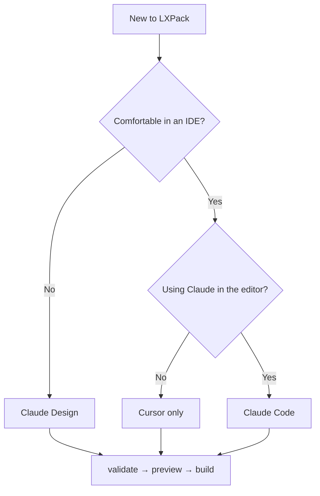

# Workflow overview

One pipeline, three authoring tracks. Everyone ends with the same commands: **validate → preview → build**.

## Pick your track

-   :octicons-pencil-24: **[Claude Design](workflow-claude-design.md)**

    ---

    Instructional designers: Claude for drafts, any editor + Terminal for `lxpack`.

-   :octicons-tools-24: **[Cursor without Claude](workflow-cursor.md)**

    ---

    IDE file tree and integrated terminal; you write the content.

-   :octicons-code-24: **[Claude Code](workflow-claude-code.md)**

    ---

    Cursor + Claude Agent, optional Git, monorepo-friendly.

## Shared pipeline

| # | Step | Command / action |
|---|------|------------------|
| 1 | Plan | Objectives, storyboard, LMS target |
| 2 | Edit | `course.yaml`, `lessons/`, `assessments/`, `interactions/` |
| 3 | Validate | `lxpack validate` |
| 4 | Review | `lxpack preview` |
| 5 | Export | `lxpack build --target …` |
| 6 | Deploy | LMS admin imports `.lxpack/*.zip` |

--8<-- "commands/core-workflow.md"

## From Storyline, Rise, or Captivate?

Start with [Migrating from legacy tools](migrating-from-legacy-tools.md) — you keep instructional design skills; the file model changes from slides to **folders + web pages**.

## Related guides

See [Build courses](build-overview.md) for lesson, quiz, and export depth. For AI:

- [Prompts for Claude & Cursor](prompts-for-claude.md)
- [Library Skills](library-skills.md)

!!! info "v0.6.3 / LessonKit 1.0"
    **v0.6.3** supports LessonKit **1.0** via `@lessonkit/lxpack` and `lxpack build --lessonkit`. React authors should start at [github.com/eddiethedean/lessonkit](https://github.com/eddiethedean/lessonkit) (`lessonkit package`). YAML/markdown authors use `lxpack` directly. Phase 5 may add more LXPack-side automation.
