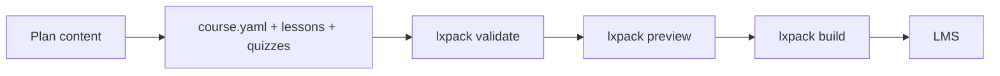

# LXPack

<span class="version-badge">v0.5.0</span>

<p class="hero-lead">
LXPack turns courses into <strong>web-native learning experiences</strong> — Markdown lessons, interactive labs, and quizzes in simple files — then <strong>preview</strong>, <strong>validate</strong>, and <strong>export</strong> SCORM, xAPI, or cmi5 for your LMS. Built for instructional designers and AI-assisted authoring (Claude, Cursor).
</p>

<div class="grid cards" markdown>

-   :octicons-rocket-24: **Get started in 15 minutes**

    ---

    Install the CLI, scaffold a course, preview in the browser, and build your first SCORM ZIP.

    [:octicons-arrow-right-24: Start here](getting-started/index.md)

-   :octicons-workflow-24: **Choose your workflow**

    ---

    Claude Design, Cursor without AI, or Claude Code — same `lxpack` commands, different tools.

    [:octicons-arrow-right-24: Workflow overview](guides/workflow-overview.md)

-   :octicons-sparkles-24: **AI authoring**

    ---

    Copy-paste prompts with clipboard buttons, plus installable Library Skills for agents.

    [:octicons-arrow-right-24: Prompts & skills](guides/prompts-for-claude.md)

-   :octicons-package-24: **Ship to your LMS**

    ---

    Pick SCORM 1.2, SCORM 2004, xAPI, or cmi5 and hand off a package your LMS admin can import.

    [:octicons-arrow-right-24: Export guide](guides/export-to-lms.md)

</div>

## How it works



| Step | What happens |
|------|----------------|
| **Structure** | `course.yaml` lists lessons, labs, and quizzes |
| **Author** | Markdown, HTML interactions, YAML assessments |
| **Check** | Validation catches broken paths and schema issues |
| **Review** | Local preview in the browser before publish |
| **Export** | ZIP under `.lxpack/` for your LMS |

## Quick start

--8<-- "commands/install.md"

--8<-- "commands/new-course.md"

```bash title="Start local preview server"
lxpack preview
```

[:octicons-arrow-right-24: Full install guide](getting-started/install-cli.md) · [:octicons-arrow-right-24: Your first course](getting-started/your-first-course.md)

## Find your path

| You are… | Go to |
|----------|--------|
| New to LXPack | [Get started](getting-started/index.md) |
| Leaving Storyline / Rise / Captivate | [Legacy migration](guides/migrating-from-legacy-tools.md) |
| Using Cursor (no Claude) | [Cursor workflow](guides/workflow-cursor.md) |
| Developer with Claude Code | [Claude Code workflow](guides/workflow-claude-code.md) |
| LMS or technical reviewer | [Export](guides/export-to-lms.md) · [CLI reference](reference/cli.md) |
| Contributing to LXPack | [Developer docs](developer/index.md) |

## Example courses

Clone the repo and open these folders:

| Example | Demonstrates |
|---------|----------------|
| [`security-awareness`](https://github.com/eddiethedean/lxpack/tree/main/examples/security-awareness) | Linear course, SCORM 1.2 |
| [`branching-demo`](https://github.com/eddiethedean/lxpack/tree/main/examples/branching-demo) | Variables, flow, components |
| [`xapi-awareness`](https://github.com/eddiethedean/lxpack/tree/main/examples/xapi-awareness) | xAPI + `tracking.xapi` |
| [`cmi5-demo`](https://github.com/eddiethedean/lxpack/tree/main/examples/cmi5-demo) | cmi5 export |
| [`lessonkit-spa`](https://github.com/eddiethedean/lxpack/tree/main/examples/lessonkit-spa) | SPA lesson + bridge API, SCORM 1.2 |

!!! info "Roadmap"
    **v0.5.0** is the current release (LessonKit thin packaging: `packageLessonkit`, interchange schema v1, `lxpack build --lessonkit`). **v0.4.0** added SPA lessons, `@lxpack/api`, and `lessonkit.json` merge. Deeper bridge SDK and conformance tooling are planned for **v0.6+**; today you author files (with Claude or by hand) and run `lxpack` to validate, preview, and build.
