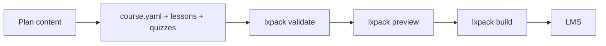

---
hide:
  - title
---

<div class="lx-hero">
  <div class="lx-hero-badges">
    <span class="lx-badge lx-badge--accent">v0.6.2</span>
    <span class="lx-badge">SCORM · xAPI · cmi5</span>
    <span class="lx-badge">AI-native authoring</span>
  </div>
  <p class="lx-hero-title">Build learning experiences that ship to your LMS</p>
  <p class="lx-lead">LXPack turns courses into <strong>web-native learning experiences</strong> — Markdown lessons, interactive labs, and quizzes in simple files — then <strong>preview</strong>, <strong>validate</strong>, and <strong>export</strong> for your LMS.</p>
</div>

Pick the path that matches how you work:

<div class="grid cards" markdown>

-   :octicons-file-code-24: **File-based authoring**

    ---

    `course.yaml`, Markdown lessons, HTML labs, YAML quizzes — no React required.

    [:octicons-arrow-right-24: Start here](guides/file-based/index.md)

-   :octicons-sparkles-24: **AI-assisted authoring**

    ---

    Claude Design, Cursor, or Claude Code — copy-paste prompts and Library Skills.

    [:octicons-arrow-right-24: AI workflows](guides/ai-assisted/index.md)

-   :octicons-code-24: **LessonKit & React**

    ---

    React courses with LessonKit 1.0; package via `@lessonkit/lxpack`.

    [:octicons-arrow-right-24: Integrator hub](guides/lessonkit/index.md)

-   :octicons-package-24: **Ship to your LMS**

    ---

    SCORM 1.2, SCORM 2004, xAPI, cmi5, or standalone ZIP.

    [:octicons-arrow-right-24: Export guide](guides/export-to-lms.md)

</div>

<div class="lx-callout">
  <strong>Node.js:</strong> 18 or 20 for <code>lxpack</code> CLI · LessonKit <code>lessonkit package</code> requires <code>@lxpack/api</code> 0.6.2+.
</div>

## How it works



## Quick start

--8<-- "commands/install.md"

--8<-- "commands/new-course.md"

```bash title="Start local preview server"
lxpack preview
```

[:octicons-arrow-right-24: Full install guide](getting-started/install-cli.md) · [:octicons-arrow-right-24: Your first course](getting-started/your-first-course.md)

## Find your path

| You are… | Go to |
|----------|--------|
| New to LXPack | [File-based authoring](guides/file-based/index.md) |
| Using AI tools | [AI-assisted authoring](guides/ai-assisted/index.md) |
| **React / LessonKit author** | [LessonKit & React](guides/lessonkit/index.md) |
| Leaving Storyline / Rise / Captivate | [Legacy migration](guides/migrating-from-legacy-tools.md) |
| LMS or technical reviewer | [Export](guides/export-to-lms.md) · [CLI reference](reference/cli.md) |
| Contributing to LXPack | [Project docs](developer/index.md) |

## Examples

See [Example courses](examples/index.md) — `security-awareness`, `branching-demo`, `lessonkit-spa`, and [LessonKit lxpack-golden](https://github.com/eddiethedean/lessonkit/tree/main/examples/lxpack-golden).
