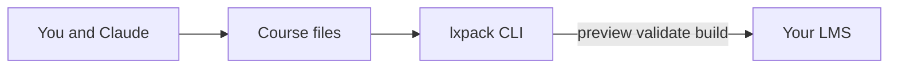

# LXPack documentation

**LXPack** is an AI-native learning experience compiler. You describe a course as files on your computer (lessons, quizzes, activities), preview it in a browser, and export a package your LMS can run — SCORM, xAPI, or cmi5.

**Current release:** v0.3.0

## Who this documentation is for

| You are… | Start here |
|----------|------------|
| Instructional designer or LXD, new to LXPack | [What you need](getting-started/what-you-need.md) → [Your first course](getting-started/your-first-course.md) → [Workflow with Claude Design](guides/workflow-claude-design.md) |
| Moving from Storyline, Rise, or Captivate | [Migrating from legacy tools](guides/migrating-from-legacy-tools.md) |
| Using Cursor without Claude (IDE only) | [Workflow with Cursor](guides/workflow-cursor.md) · [Copy-paste prompts](guides/prompts-for-claude.md) |
| Developer or power user with Cursor + Claude | [Workflow with Claude Code](guides/workflow-claude-code.md) |
| LMS admin or technical reviewer | [Export to your LMS](guides/export-to-lms.md) and [Reference](reference/cli.md) |

You do **not** need to be a software developer to author with LXPack. You will run a few commands in Terminal and edit text files — on your own, in Cursor, or with help from Claude.

## What LXPack does

1. **Structure** your course in `course.yaml` (the table of contents and settings).
2. **Author** lessons as Markdown, activities as web pages, and quizzes as simple YAML files.
3. **Preview** locally so stakeholders can click through before you publish.
4. **Validate** automatically so broken links or missing files are caught early.
5. **Build** a ZIP (or folder) for SCORM 1.2, SCORM 2004, xAPI, cmi5, or standalone HTML.



## Quick install

```bash
npm install -g @lxpack/cli
lxpack init my-course
cd my-course
lxpack preview
```

Open the URL shown in Terminal (default `http://127.0.0.1:3847`). See [Install the CLI](getting-started/install-cli.md) for step-by-step setup on Mac and Windows.

## Example courses in the repository

| Example | What it demonstrates |
|---------|----------------------|
| `security-awareness` | Linear course, markdown + HTML lab, SCORM 1.2 |
| `branching-demo` | Variables, branching flow, components, SCORM 2004 |
| `xapi-awareness` | xAPI export with `tracking.xapi` |
| `cmi5-demo` | cmi5 export |

## Choose your workflow

Not sure which path fits you? See [Workflow overview](guides/workflow-overview.md).

!!! note "Phase 4 — AI tooling (planned)"
    Future releases may add deeper Claude/CLI integration (`repair`, AI-generated interactions). Everything in this documentation works with **v0.3.0** today: Claude (Design or chat) helps you edit files; `lxpack` validates, previews, and builds.

## Developer documentation

Contributors and engineers: [Developer docs](developer/index.md) (spec, roadmap, architecture).
